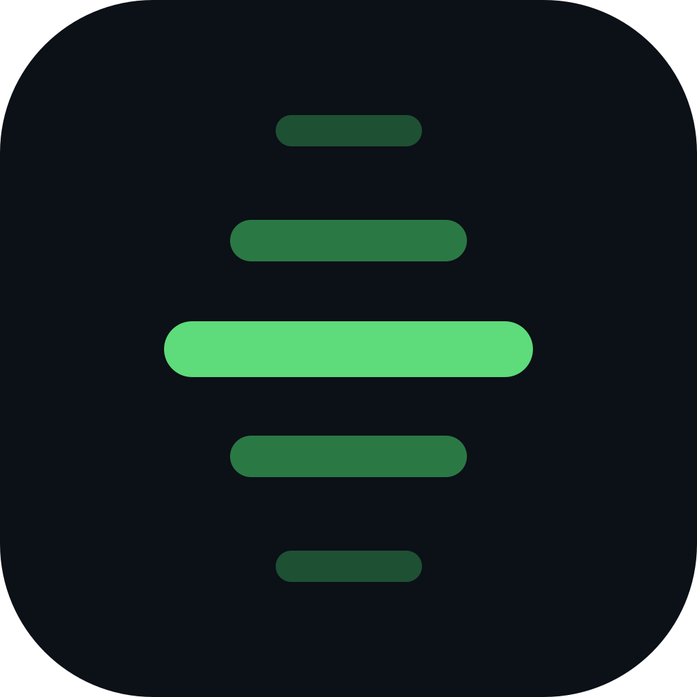
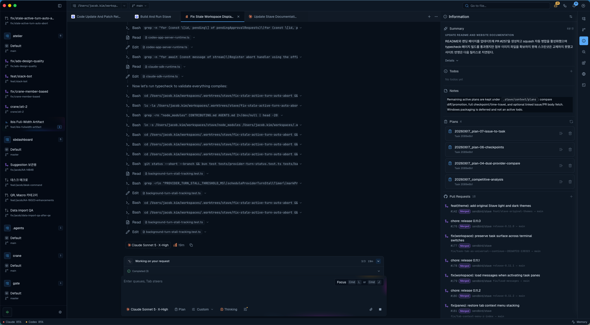

<div align="center">
  
</div>

# Stave

Stave is a desktop AI coding workspace for Claude, Codex, Cursor Agent, and Kiro CLI. It combines task-oriented chat, repo-aware context, an editor and terminal, workspace memory, and local automation in one app.



## Install the App on macOS

The packaged macOS install flow uses GitHub CLI authentication:

```bash
gh api -H 'Accept: application/vnd.github.v3.raw+json' repos/sendbird/stave/contents/scripts/install-latest-release.sh | bash
```

If this is your first time using `gh`, or you need SSO or scope help, see the full [Install Guide](docs/install-guide.md).

Packaged macOS builds can also check for updates from the top bar and install them in place.

## Build from Source

Requirements:

- Bun
- Node.js >= 20
- a native build toolchain for `better-sqlite3` and `node-pty`

Install dependencies:

```bash
bun install
```

Start the Electron app in development:

```bash
bun run dev:desktop
```

Useful command for validating a packaged desktop build:

```bash
bun run run:desktop:packaged:logged
```

This rebuilds Electron native dependencies, produces the desktop build, launches the packaged app, and writes a timestamped log file for debugging packaged-only issues.

For other development, packaging, and contribution commands, see [Developer and Contributing Guide](docs/developer/contributing.md).

## Provider Setup

To use provider-backed chats, install and authenticate the CLIs you want Stave to drive.

```bash
claude auth login
codex login
agent login
kiro-cli login
```

Recommended next steps:

- Open `Settings -> Providers` and choose the runtime controls you want.
- Open `Settings -> MCP` if you want to enable the built-in local MCP server.
- If macOS asks for Desktop, Documents, or Downloads access, approve it once or see [macOS Folder Access Prompts](docs/features/macos-folder-access-prompts.md).

## Features

- English (default) and Korean throughout the app; switch in Settings or the home menu, with the choice saved across restarts
- task-based Claude, Codex, Cursor Agent, and Kiro CLI chats with approvals, diffs, and queued follow-ups
- usage-limit pauses with manual or reset-time resume, and restored queues that wait for you after a restart
- other tasks attached as context through title search or a sidebar drag, with a choice of the latest reply or recent conversation
- Monaco editor, docked terminal, quick open, command palette, and source control actions
- Lens browser panel for inspecting a live page and pulling DOM, console, or element context into a task draft
- Compare Runs with candidate and judge turns, and Review tasks that run a read-only review on the model you pick beside the task and hand back only the findings, with configurable review presets, installed skills or custom prompts
- Crane connector for queuing repository issues into approval-gated local Claude or Codex runs
- Issues surface listing assigned Crane and Jira Cloud tickets with one-click local kickoff
- workspace documents (plans, reports, specs) that agents revise in place, with every revision recorded
- workspace-scoped notes, todos, PR links, Jira, Figma, Confluence, and Slack references
- scheduled Claude and Codex automations with per-run results, repository selection, and reusable Information context
- agents with a workflow: the stages you would otherwise prompt one by one — Stave opens the draft PR, watches checks, and checks in with you only where the agent says
- Agent performance for comparing delegated runs across workspaces, and task Outputs for inspecting saved answers and changes
- git worktree-aware repository and workspace management
- editable workspace kickoff proposals from external sources and prompts
- Fleet `Action required` inbox for questions, approvals, agent run sign-offs, failed runs, results, and PR blockers across every workspace
- notifications, attachments, skill selection, custom model shortcuts, and theme presets
- local-only MCP access for same-machine automation and tool-driven workflows

## Documentation

- [Install Guide](docs/install-guide.md) for the full macOS install and update flow
- [Lens Browser Guide](docs/features/lens.md) for inspecting a live page and sending its context into a task draft
- [Provider Browser Access](docs/features/provider-browser-access.md) for using `@web` with the active provider's native browser extension
- [Provider Sandbox and Approval Guide](docs/features/provider-sandbox-and-approval.md) for runtime safety and second opinions
- [Workspace Documents](docs/features/workspace-documents.md) for plans and reports an agent writes and revises
- [Turn Activity](docs/features/turn-activity.md) for queued follow-ups, restart recovery, and resuming work after a usage limit
- [Attachments](docs/features/attachments.md) for files, images, and other tasks used as context
- [Review Tasks](docs/features/review-tasks.md) for reviews and second opinions that run in their own read-only task
- [Agent Performance and Task Outputs](docs/features/results.md) for choosing between cross-workspace metrics and a task's saved outputs
- [Local MCP User Guide](docs/features/local-mcp-user-guide.md) for same-machine automation setup
- [Crane Connector Guide](docs/features/crane-connector.md) for pairing Crane with this Stave installation and approving issue runs locally
- [Issues Guide](docs/features/issues.md) for reviewing assigned Crane and Jira tickets and kicking one off locally
- [Fleet Action Required Guide](docs/features/fleet-needs-me.md) for working through approvals, questions, and blockers across every workspace
- [Workspace Kickoff](docs/features/workspace-kickoff.md) for source matching, MCP resolution, and Information panel defaults
- [Agent runs](docs/features/agent-runs.md) for assigning an outcome to an agent and following its stages
- [Agents](docs/features/agents.md) for saving workers, assigning work to them and following each task's flow

## For Developers And Contributors

Development setup, build and packaging commands, architecture pointers, and contribution guidance live in [Developer Docs](docs/developer/index.md) and the [Developer and Contributing Guide](docs/developer/contributing.md).

## License

[Apache-2.0](LICENSE) — see [NOTICE](NOTICE) for attribution.
