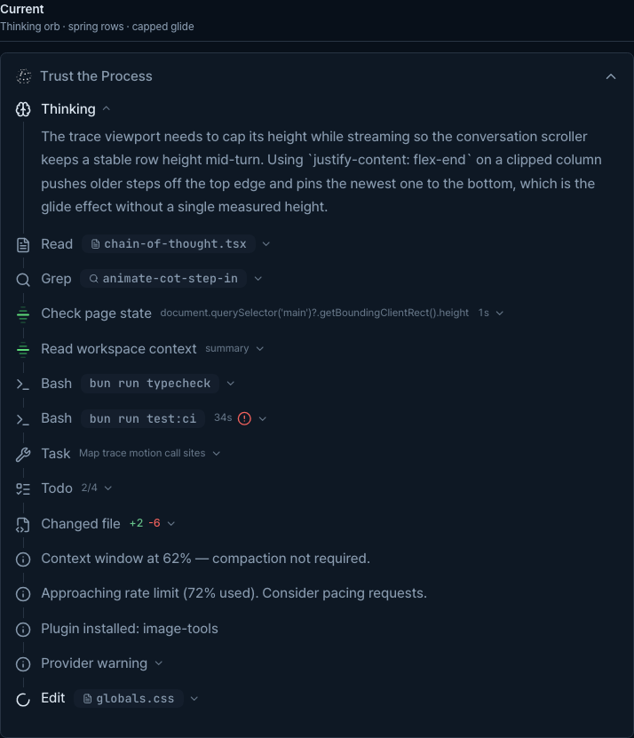

# Agent Message UX Catalog

This is the working UX contract for agent messages. It connects normalized
provider events to persisted message parts, rendered surfaces, and task-level
state so future provider or AI Elements changes can be checked against one
reference.

## Current Preview

Open the dev-only [Agent trace Preview](http://localhost:5173/?stavePreview=agent-messages)
while the Vite development server is running. The Preview uses the same
`AssistantMessageBody` path as production chat and puts the current treatment
beside the legacy comparison for visual QA.

The documented baseline is:

- `Streaming` enabled
- `Dark` enabled
- `18px` font size
- `cascade` phrase animation
- the `Current` column selected for inspection



This screenshot is a durable visual reference for the current column. Use the
live Preview for interaction and motion checks.

The Preview controls intentionally expose the variables most likely to change
the trace geometry: streaming versus completed state, light versus dark theme,
font size, and `cascade` / `swap` / `scramble` reasoning-label animation.

The current column exercises these visible cases in one trace:

- thinking orb and streaming reasoning viewport
- Read, Grep, Bash, Edit, and Stave-owned MCP rows
- human-readable Stave tool titles and Stave identity, while third-party MCP
  identity remains unchanged
- successful output, live input, elapsed time, and a failed tool result
- subagent progress and nested output
- Todo progress
- changed-file diff summary
- single-line system notices, rate-limit guidance, plugin installation, and a
  multi-line provider warning
- the final assistant response

The source of truth for the Preview is
[`src/dev/agent-preview/index.tsx`](../../src/dev/agent-preview/index.tsx) and
[`src/dev/agent-preview/fixtures.ts`](../../src/dev/agent-preview/fixtures.ts).
The Preview is dev-only; it is a repeatable visual fixture, not a product route.

## Rendering Pipeline

```text
provider adapter
  → NormalizedProviderEvent
  → provider-event replay
  → ChatMessage.parts and task-level state
  → AssistantTrace / MessageResponse / task controls
```

The event contract lives in
[`src/lib/providers/provider.types.ts`](../../src/lib/providers/provider.types.ts).
Replay and state transitions live in
[`src/lib/session/provider-event-replay.ts`](../../src/lib/session/provider-event-replay.ts).
The persisted part contract is in
[`src/types/chat.ts`](../../src/types/chat.ts).

## Normalized Provider Event Matrix

The following table is exhaustive for `NormalizedProviderEvent`. “No transcript
row” means that the event still matters to the turn or task, but should not
become a second visible assistant message.

| Event | Persisted or derived result | UX case | Preview |
| --- | --- | --- | --- |
| `thinking` | `thinking` part, grouped as a reasoning trace entry | Show the Thinking label and orb while streaming; cap and bottom-anchor the prose; show a duration summary after completion | Covered |
| `text` | `text` part, with an optional segment boundary | Keep interim commentary in the trace and render the final segment as `MessageResponse`; never merge unrelated provider segments | Covered |
| `provider_session` | Provider session cursor state | Keep the native session available for resume and provider switching; no transcript row | Metadata only |
| `provider_turn` | Native session and turn ids on the assistant message | Make point-in-time fork, rewind, and follow-up actions target the turn that produced the response; no transcript row | Metadata only |
| `goal_status` | Task-level `providerGoalByTask` state | Reflect Codex goal progress and blocked, limited, or completed control states outside the message body | Metadata only |
| `usage` | `ChatMessage.usage` | Show token, cache, cost, and TTFT details in the message footer and aggregate task summaries | Metadata only |
| `prompt_suggestions` | `ChatMessage.promptSuggestions` | Offer follow-up chips in the composer without inserting assistant text into the transcript | Metadata only |
| `advisor_activity` | Advisor lifecycle state outside the transcript | Distinguish started, completed, applied, failed, timeout, aborted, and skipped advisor work; advice must not become a normal assistant bubble | Metadata only |
| `history_boundary` | `providerBoundary` on the target message | Enable history fork and rewind actions at the exact native thread, turn, or message boundary; no transcript row | Metadata only |
| `permission_denial` | `system_event` with a normalized denial message | Explain which tool was denied and why in the trace without pretending it was a tool result | Not yet |
| `hook_activity` | Turn-status or activity state | Surface hook running, completed, failed, cancelled, or blocked status in activity-oriented UI; no transcript row | Metadata only |
| `tool` | `tool_use` part | Render a trace row with kind icon, human summary, state, elapsed time, input, and output; specialize Task, TodoWrite, and file changes | Covered |
| `tool_progress` | Updates the matching `tool_use` part | Update elapsed time in place and resolve stale interaction targeting; do not append a duplicate tool row | Covered indirectly |
| `tool_result` | Merges output and error state into the matching `tool_use` part | Show partial live output, bounded scrollable output, copy affordance, and an expanded error; do not create a second accordion with the same content | Covered indirectly |
| `diff` | `code_diff` part, grouped by file | Show a changed-file trace step and the completed changed-files surface with accept or reject actions | Covered |
| `approval` | `approval` part | Keep an explicit confirmation card open and actionable; approval, rejection, interruption, and denial remain distinguishable | Not yet |
| `user_input` | `user_input` part | Keep the question card open until answered or denied; support text, choice, multi-select, numeric, boolean, and URL-notice flows | Not yet |
| `plan_ready` | Separate or updated plan assistant response | Remove transient plan markup from the normal response and show the durable plan in the plan viewer without duplicating it in the chat bubble | Not yet |
| `system` | `system_event` part | Use specialized UX for compacting, compacted checkpoints, truncation warnings, and generic notices; a single-line notice is rendered once, while distinct detail can expand | Partially covered |
| `subagent_progress` | Appends to the matching Agent `tool_use.progressMessages` | Show progress bullets inside the subagent row; if no Agent can be matched, degrade to one system event rather than dropping the signal | Covered |
| `model_resolved` | Updates message provider and model metadata | Keep the footer and status copy truthful when routing resolves to a different provider or model; no transcript row | Metadata only |
| `error` | Error system event plus turn error state | Keep recoverable errors distinguishable from terminal failures; preserve subsequent recovery and explain a terminal stop | Not yet |
| `done` | Finalizes the message and pending interaction states | Stop streaming, close thinking and open tool states appropriately, add truncation or “No response returned” fallback, and auto-collapse clean completed traces | Not yet |

## Persisted Message Parts Without A Dedicated Provider Event

These parts can enter a message through user attachments or normalized message
construction even though they are not separate `NormalizedProviderEvent` types.

| Part | UX surface | Invariant |
| --- | --- | --- |
| `file_context` | Referenced-file block | Preserve the full workspace-relative path and language metadata; do not reduce a path to a basename when it would lose identity |
| `image_context` | Image attachment block | Keep the image label and MIME type available to the renderer; avoid exposing raw data URLs in visible copy |
| `workspace_information_context` | Workspace-information reference chip | Keep the reference compact and link it back to the Information panel source |

## Interaction Invariants

- The root trace stays open during streaming and auto-collapses only after a
  clean completed turn. Errors and pending interactions remain inspectable.
- A row is an accordion only when its body contains new information. A title
  such as `Context window at 62%` must not repeat the same sentence inside a
  nested body; multi-line warnings and compact checkpoints may expand.
- Tool results update the existing tool row by id. A result must never create a
  second row that repeats the header or input.
- Stave-owned MCP tools use the Stave icon and an action-oriented title. Other
  MCP servers retain their existing identity and naming treatment.
- The Thinking label and orb share a baseline across `cascade`, `swap`, and
  `scramble`; label animation must not move the title upward relative to the
  icon.
- The streaming thought viewport clips the prose, not the trace header. The
  label, orb, and latest-step anchor remain visible while older reasoning glides
  under the fade.
- Provider text boundaries are part of the replay contract. Adjacent text is
  merged only when it belongs to the same logical segment.

## Next Fixture Additions

The current Preview is intentionally a focused trace comparison. The following
cases are catalogued here for the next gallery expansion so they do not get
lost when the renderer changes:

- approval requested, responded, interrupted, and denied
- form and URL-mode user input, including validation and denial
- compacting spinner, compacted checkpoint restore, and truncation warning
- provider permission denial, recoverable error, terminal error, and no-response
  completion
- plan response and transient plan cleanup
- file, image, and workspace-information context parts
- prompt suggestions, goal status, usage footer, advisor lifecycle, and hook
  activity at their task-level surfaces

When adding a new event or changing an event payload, update this catalog,
`NormalizedProviderEvent`, its schema, replay behavior, and the corresponding
Preview fixture in the same change.
