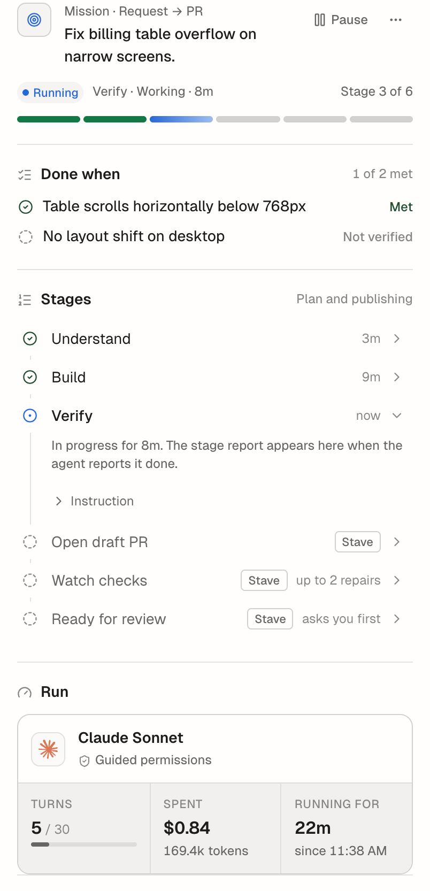

# Agent Runs And Their Stages

## Summary

When you assign work to an agent, Stave runs it stage by stage. An agent with
a **workflow** follows its stages — asks the agent for each AI stage, opens the
draft pull request, watches its checks, marks it ready — and stops only where
its **Check in with me** setting says, or when something needs you. An agent
without a workflow runs one stage that plans its own steps.

The product calls one a **Run**; inside Stave the engine is called an *agent
run* (`AgentRun`). The product shows the agent, its stages and its result.
Legacy runs, started from playbooks before playbooks folded
into agents finish as they are, and their surfaces keep working.

## When To Use It

- The work has a shape you repeat: reproduce, fix, verify; or validate, open a
  pull request, get the checks green, request review. Give an agent that
  workflow (Agents → an agent → **Workflow**) or use a built-in that has one
  (Debugger, UI Polisher, Shipper).
- You want the task to keep moving while you do something else, and to be told
  only when it needs a decision.
- For a one-off question or a small edit, send a normal message instead. For
  scheduled work that starts a new task each time, use an
  [automation](automations.md).

## Before You Start

- The task runs on Claude or Codex.
- Stave's local tools are on (Settings → Developer → Local MCP). The agent
  reports each stage through them; without them a run cannot start.
- For workflows with pull request stages, the GitHub CLI is signed in
  (`gh auth login`).

## Quick Start

1. Pick an agent in the composer's selector (`Alt+P` → **Agents**), or run
   **Assign to an agent…** from the command palette.
2. Type the outcome, for example
   `Fix the billing table overflow on narrow screens.`, and send.
3. The run starts at once. With more than one stage, the status line above the
   composer shows the stage track and the Task panel's **Progress** names the
   workflow (`Workflow: Reproduce → Cause → Fix`) and lists each stage and its
   report. A one-stage run shows the agent's own plan instead: its latest to-do
   list (Claude's to-do tool, Codex's plan updates) as **Plan 3/5** on the
   status line, between turns too, and as a checklist under **Plan** in
   **Progress** and in the report.

## Interface Walkthrough

### Entry Points

- The composer's selector, **Agents** section, then send.
- **Assign to an agent…** in the command palette, or `!assign` in the
  composer.
- **Who** in [Workspace Kickoff](workspace-kickoff.md): pick an agent and
  click **Assign**.

### Check in with me

An agent's **Check in with me** decides where a run waits for you between
stages:

- **Only when stuck** (default): never, unless a stage is blocked or stuck.
  Assigning the work is the go-ahead for the workflow's publishing stages.
- **Before publishing**: before the stage after a plan, before a publish
  stage and before **Ready for review**; every stage that acts outside this
  machine asks first.
- **Every stage**: before each stage after the first.

A run records your own permission settings for its turns; a saved agent never
grants permissions.

### Agent run line

The run line of the composer shelf, above the prompt input, for as long as an
agent run is going, between its turns included (see
[Turn Activity](turn-activity.md#the-composer-shelf)):

- The current stage and what it is doing — a plain phrase such as
  **Running the tests** while a turn runs, or what it waits for and for how
  long, such as **Waiting for your sign-off · 8m**. A stage turn that stalls,
  steers, retries or fails says so instead, as the turn's line would:
  **Stalled · No updates for 2m** with how to stop or interrupt it.
- The stage track, one line high: the stages behind the run fill it and the
  head names the stage in progress and where it stands (`Verify 3/6`). When
  the composer is too narrow for the track, the line says `3/6` in words. A
  hand marks a stage that asks you first.
- **Take over** pauses the agent run so your replies are your own; **Resume**
  hands the task back. A reply without Take over guides the current stage and
  the agent run carries on.
- The panel button opens the Task panel's **Progress** tab; the details toggle
  unfolds the current turn's rows.

### Sign-off

When a stage waits for you, a card appears where tool approvals appear:
**Ready to start Verify?**, with what the previous stage produced (files
changed, evidence Stave verified) and its summary. Its corner shows the stage,
the turns used of the limit and what the agent run has spent, such as
**Stage 3 of 6 · 5 of 30 turns · $0.84**.

- The primary button names what happens, such as **Start Verify** or
  **Mark ready for review**.
- **Review changes** opens Source Control.
- **Ask for changes** sends a note and runs the last AI stage again.

### Agent run in the Task panel

The **Progress** tab of the right rail's Task panel, while the task has an
agent run (a task without one shows its flow there):

- The goal, a state badge (**Running**, **Needs you**, **Blocked**,
  **Stuck**, **Paused**, **Completed**), and the stage track.
- **Done when**: the acceptance criteria the agent reported, each **Met**,
  **Not met** or **Not verified**.
- **Stages** as a timeline. Open a stage for its summary, decisions with their
  reasons, evidence (**Verified by Stave** first, with **Show** to jump to the
  tool call in the transcript), links, and the instruction it ran with.
- **Retry stage** and **Skip stage** on a blocked or stuck stage; **Pause**,
  and **Stop run** in the **⋯** menu.
- **Run**: who runs the agent run — the provider's mark, the model by name and
  the permissions — above its figures: **Turns** against the budget (the bar
  turns amber close to the limit, where the agent run stops), **Spent** (the
  cost and tokens the provider reported; tokens alone for a provider that
  reports no cost), and how long it has been running. A note says when a
  turn reported no usage.
- The task's wake-up, the other thing that can start turns on the task.

The task's subagents are in the **Subagents** tab next to it.

### Acceptance and check evidence

A finished provider turn or subagent does not complete a stage by itself. The
current turn must report completion, and any required criteria authored for
that stage must be reported **Met**. Criteria for the overall goal are checked
at the final stage; a Build stage can pass to Test while future checks are
still pending. A simple answer or documentation stage requires no shell check
unless its workflow explicitly requires one. Manual sign-off and Skip remain
available.

Workflow stage criteria support `text`, optional `required` (true by default),
and optional `verification`. AI stages use `agent-report`: this records the
agent's assessment. Required `stave-check` criteria belong to a **Run script**
action stage; omitting verification on that action has the same meaning. Other
action stages cannot require a workspace script check. To require host-observed
tests after an AI stage, add a Run script stage using a configured workspace
action script.

Check evidence separates **Provider result** and **Agent reported** claims from
successful host checks of unchanged work. A tool response without a structured
process exit code has an unknown exit status, even if its text says it passed.
Claude tool errors remain failures; Codex's structured process exit code is
preserved. A Run script check captures the workspace state before and after
the actual process. Required checks need exit 0 and matching known revisions.
Changes during or after the check make its evidence stale; unavailable or
bounded workspace snapshots show **Current work unverified**. Viewing a report
never stamps a new revision onto an older command. Historic records without
process or revision provenance remain unverified.

### Transcript

A quiet divider marks every turn an agent run started, with the reason, such as
**Stage 3 · Verify** — started automatically after Build reported done. An
agent run with a workflow gets the same dividers; a one-stage run has none.

### Agent run report

When an agent run ends, its report tops the Task panel's **Progress** and
**Results** tabs:
outcome, figures (duration, stages, turns, verified evidence, what it spent), links,
decisions, what is still open, what was left behind, and how much the agent run
needed you. **Copy Markdown** and **Add to PR description** act on it, and
**More** holds the rest:

- **Save decisions to memory**, as memory candidates you review.
- **Share to Slack…**: paste a thread link (the one in the assignment is
  filled in) and the agent run's task posts the report there once, as a reply,
  with your Slack tools. It changes no files and waits while the task is in a
  turn.

### Results

**Results** (in the sidebar under Agents, the Fleet header link, or **Open
Results** in the command palette) shows how agent runs and legacy runs that ended in the last 7,
30 or 90 days came out:

- **Outcomes**: ready, rework (the result needed requested changes), failed
  (Stave stopped the run) and stopped (you stopped it), with the share ready.
- **Time to ready** (median) and **cost per ready result**, with how many runs
  reported no cost (Codex reports tokens only).
- **Why runs did not finish**, one cause per run: stuck stage, turn cap
  reached, expired, task unavailable, turn failed, or stopped by you.
- **Corrections per run**: your replies, requested changes and reminders.
- **Agents**: one row per agent, or per saved workflow of a legacy run (tagged
  `workflow`), with ready rate, median cost,
  corrections and its last ten outcomes. A row opens its recent runs, and a run
  opens its report.

### Fleet and notifications

- A sign-off, a blocker or a stuck stage appears in Fleet's attention list with
  approvals and questions. A sign-off can be given from the row.
- Fleet cards show the agent run's stage track (a one-stage run: **Plan 3/5**)
  and what it has spent, and the
  work queue puts the workspace in **Action required** or **In progress**.
- Stave notifies once when an agent run asks for a sign-off, is blocked, is stuck
  or completes. **Settings → General → Run Sign-off Reminders** sets when
  a waiting sign-off reminds you again, batched into one notification.

## Common Workflows

### Steer a running agent run

- Reply in the task to add guidance; the stage continues with it.
- Click **Take over** to stop the agent run's turns while you work yourself,
  then **Resume** to hand it back.

### Recover a stuck or blocked stage

1. Open the Task panel's **Progress** tab; the stage says why it stopped.
2. Answer the question in the task, or fix what it names.
3. Click **Retry stage**, or **Skip stage** to move on.

## Files And Data

- Agent runs are stored in Stave's local database with their stage records and
  events. Nothing is sent anywhere except what the stages themselves do (pull
  requests on GitHub, messages through your own tools).
- The agent's workflow is copied into the run when it starts; later edits to
  the agent do not change a running run.

## Limitations And Advanced Options

- Agent runs run on Claude and Codex tasks, one agent run per task at a time.
- An agent run uses the task's current model. If you change it, the agent run
  pauses until you accept the new runtime for the remaining stages.
- Pull request stages use the GitHub CLI and watch every check reported for
  the pull request. **Open draft PR** commits what was left and pushes the
  branch before it opens the pull request, or before it continues one the
  branch already has, so a rerun after **Ask for changes** reaches it too.
  **Ready for review** pushes the workspace's latest commits first when the
  pull request lacks them.
- If Stave quits while a stage's turn runs, the stage continues with a new turn
  after the restart; that turn does not use up the stage's one reminder.
- **Spent** counts the turns the agent run started. Claude reports a cost with
  each turn; Codex reports tokens only, so a Codex agent run shows tokens. Turns
  whose provider reported nothing are counted and named, not guessed. Cache
  reads are part of the cost but not of the token count.
- An agent run started at a later stage has no acceptance criteria from
  **Understand**, so its report shows only what the stages that ran reported.

## Troubleshooting

### "Reporting unavailable"

- Symptom: a stage is blocked with **Reporting unavailable**.
- Cause: Stave's local tools are off or not running, so the agent cannot
  report its stage.
- Fix: turn on Local MCP in Settings → Developer, then **Retry stage**.

### A pull request stage is blocked

- Symptom: **Open draft PR** or **Watch checks** stops with a sentence about
  GitHub.
- Cause: `gh` is signed out, the branch is protected, the push was refused, or
  the workspace is on the base branch (Stave never commits or pushes to it).
- Fix: follow the sentence (for example run `gh auth login`, or move the work
  to a feature branch), then **Retry stage**.

### Watch checks is stuck after a repair

- Symptom: **Watch checks** says the checks repair turn was stopped, failed or
  was interrupted.
- Cause: Stave pushes a repair only when its turn finished, so half a repair or
  your own edits are never pushed on their own.
- Fix: check the workspace, commit what should go up, then **Retry stage**.

### A stage is stuck

- Symptom: the stage says **Stuck** after the agent ended a turn without
  reporting, even after one reminder, or because its turn could not start.
- Fix: read the transcript, reply with what is missing, and **Retry stage**.
  A stuck stage continues on its own only for a reply sent after it got stuck.

## Related Docs

- [Agents](agents.md) — an agent's Workflow and Check in with me
- [Playbooks (retired)](playbooks.md)
- [Wake-ups](wake-ups.md) — an agent run pauses its task's wake-up while it runs
- [Notifications](notifications.md)
- [Agent Platform Taxonomy](../architecture/agent-platform-taxonomy.md)
