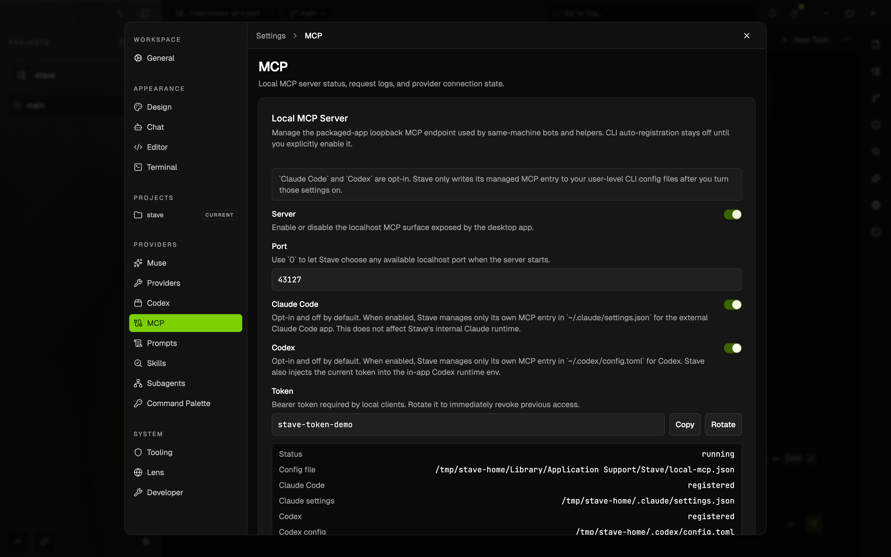

# Local MCP User Guide

This guide explains how a packaged Stave desktop user can expose the built-in local MCP server to same-machine automation tools.



This screenshot captures the Local MCP controls in `Settings > MCP`. The
current view also places a shared Claude and Codex connection manager above
the Local MCP Server and request log cards. See
[MCP Server Management](./mcp-server-management.md) for adding, editing, and
removing external provider servers.

## Who This Is For

Use this when:

- Stave is installed as a desktop app
- the bot and Stave run on the same machine
- you want the bot to create workspaces, run tasks, and answer approvals through Stave

This is not a remote internet-facing setup. Stave's embedded server is loopback-only, and the app also publishes a companion stdio proxy path for hosts that cannot reach `127.0.0.1` directly.

## What Stave Exposes

When Local MCP is enabled, Stave exposes:

- a localhost MCP endpoint for same-machine clients that can reach loopback directly
- a stdio proxy script for clients such as Codex exec hosts that need a subprocess transport instead of direct loopback HTTP

Both transports provide the same tools and task flows:

- register a project in Stave
- create a git-worktree workspace
- run a task prompt in that workspace
- read task status and turn events
- answer approval and user-input requests
- read and update the workspace Information panel

When the bundled Claude provider runs inside Stave, it also injects the same local MCP server directly into the in-app Claude runtime. That means Claude task chats can call the workspace-information tools even when Claude setting sources are limited to project-local config.

The same Local MCP server also exposes optional `stave_lens_*` tools for workspace browser sessions. They are registered by default and can be turned off under `Settings → Developer → Lens browser tools`; every tool schema is part of the prompt of each new provider session, so turning them off measurably shrinks the prompt in workspaces that never drive a browser from an agent turn. Operational tools reuse the visible/recent Lens tab or create a hidden default session automatically, so `stave_lens_open_session` is optional. Visual inspection and page interaction follow `Settings > Lens > Agent Activity`; navigation and read-only diagnostics alone stay hidden. Use `stave_lens_present_session` only when the user must immediately interact with or explicitly see the same page. The first CDP-backed action for an unapproved host shows an app-wide Stave approval dialog, even if no Lens tab is visible. Agents can manage OS-encrypted accounts with `stave_lens_list_saved_accounts`, `stave_lens_create_saved_account`, `stave_lens_update_saved_account`, and `stave_lens_delete_saved_account`. Passwords are accepted only by create/update inputs, are redacted from Stave's Local MCP request log, and are never returned by the tools. When the current exact hostname has a saved account, `stave_lens_fill_saved_account` can fill it without returning the password to the MCP client. If multiple accounts share the host, Lens uses the account enabled for automatic fill; pass `username` to select a different saved account.

If a provider needs extra user input while using Local MCP, Stave surfaces that request through the same inline task-chat input card used for approvals and other structured question flows. Form-mode elicitation is answered directly in chat, and URL-mode elicitation shows the target link plus an explicit continue / decline action.

## Open The Settings

In Stave:

1. Open `Settings`
2. Go to `Providers`
3. Open the `Stave` tab
4. Find the `Local MCP Server` card
5. Use the separate `Local MCP Request Log` card when you want inbound MCP request visibility

You can manage:

- `Server`: turn the local MCP server on or off
- `Port`: defaults to a fixed localhost port so the endpoint survives restarts. Set another fixed port, or `0` for automatic selection. If a fixed port is already taken, Stave falls back to an automatic one and records the real endpoint in the manifest
- `Claude Code`: automatically add or remove Stave's managed MCP entry in `~/.claude/settings.json`
- `Codex`: automatically add or remove Stave's managed MCP entry in `~/.codex/config.toml`
- `Token`: the Bearer token required by local clients
- `Rotate`: immediately replace the token and restart the server
- `Local MCP Request Log`: inspect recent inbound `/mcp` requests with paginated browsing, latest-page auto-refresh, response codes, timings, and on-demand sanitized payload loading

Every change is applied by restarting the local MCP server inside the app.

Both `Claude Code` and `Codex` auto-registration toggles are opt-in and default to off. Stave only writes to the user's CLI config files after the user explicitly enables those settings.

When `Claude Code` is on, Stave also keeps a user-scoped `stave-local-mcp` entry in:

- `~/.claude/settings.json`

Turning that setting off removes only Stave's managed entry. Other Claude Code MCP servers remain untouched.

When `Codex` is on, Stave also keeps a managed `stave-local` entry in:

- `~/.codex/config.toml`

That toggle removes only Stave's managed Codex block. Other Codex MCP servers remain untouched.

## Connection Info

When the server is running, the Settings card shows:

- `MCP URL`
- `Health URL`
- `Config file`
- one or more `Manifest` paths

Stave also writes a machine-readable manifest for local tools:

- `<user-home>/.stave/local-mcp.json`
- `<Stave userData>/stave-local-mcp.json`

The manifest includes:

- `url` and `token` for loopback HTTP clients
- `stdioProxyScript` for subprocess-based clients that should launch `node <stdioProxyScript>`

If `Claude Code` auto-registration is enabled, Stave also keeps the current loopback URL and bearer token synced into `~/.claude/settings.json` under `mcpServers.stave-local-mcp`.

If `Codex` auto-registration is enabled, Stave also keeps the current loopback URL synced into `~/.codex/config.toml` under `[mcp_servers.stave-local]`.

## Typical Local Automation Flow

1. Start Stave
2. Enable `Local MCP Server` in Settings if needed
3. Let the automation client read `<user-home>/.stave/local-mcp.json`
4. Choose the transport:
   - if the host can reach loopback HTTP directly, connect to the manifest `url` with `Authorization: Bearer <token>`
   - if the host cannot reach `127.0.0.1` directly, launch `node <stdioProxyScript>` and use it as the MCP stdio server
5. Call tools in this order:
   - `stave_register_project`
   - `stave_create_workspace`
   - `stave_run_task`
   - `stave_get_task`
   - `stave_respond_approval` or `stave_respond_user_input` when needed

To delegate work from a task to a durable child task, use:

- `stave_delegate_task`
- `stave_list_child_tasks`
- `stave_stop_child_task`

See [`docs/features/child-tasks.md`](child-tasks.md).

For workspace Information panel management, also use:

- `stave_get_workspace_information`
- `stave_replace_workspace_notes`
- `stave_append_workspace_notes`
- `stave_clear_workspace_notes`
- `stave_add_workspace_todo`
- `stave_update_workspace_todo`
- `stave_remove_workspace_todo`
- `stave_add_workspace_resource`
- `stave_remove_workspace_resource`
- `stave_add_workspace_jira_issue`
- `stave_add_workspace_confluence_page`
- `stave_add_workspace_storybook_resource`
- `stave_update_workspace_storybook_resource_access`
- `stave_add_workspace_figma_resource`
- `stave_add_workspace_slack_thread`
- `stave_add_workspace_custom_field`
- `stave_set_workspace_custom_field`
- `stave_remove_workspace_custom_field`

To keep a project-scoped fact for every future task of the same project
(injected each turn as `stave:project-memory`, capped at 20 lines / ~2 KB,
editable from the Information panel's Memory section):

- `stave_remember` — `{ workspaceId, kind: decision|convention|gotcha|fact, content }`
- `stave_forget` — `{ workspaceId, memoryId }`
- `stave_list_project_memories` — `{ workspaceId }`, returns ids for `stave_forget`

To read the tracker tickets Stave has cached for the signed-in user:

- `stave_list_tracker_tasks`

It is read-only and takes `source`, `statusCategories`, `search`, `limit`, and `refresh`. Starting a run from a ticket is deliberately not exposed: a kickoff spends provider budget and, for Crane, is visible to the rest of the team, so it stays a human action in the [Tasks surface](tasks.md).

Agents that already receive Stave task awareness context should treat that injected context as current.
Call `stave_get_workspace_information` only when the injected summary is missing a detail needed for the next action.
Keep notes and todos compact; store long handoff or execution details in `.stave/context/plans/` and reference the plan path from notes.

If the workflow also needs live UI inspection:

6. Call `stave_lens_navigate` or another Lens tool for the target workspace; the visible/recent session is reused or a hidden default is created automatically
7. If sign-in is required and a matching account is saved, call `stave_lens_fill_saved_account`; leave `submit` false unless the user asked the agent to sign in
8. Let the user's `Agent Activity` preference handle visual inspection and page interaction; call `stave_lens_present_session` only if immediate interaction, sign-in, or explicit display is required
9. Prefer low-token reads first: `stave_lens_snapshot` for page structure, scoped `stave_lens_get_text` for copy, and selector screenshots for visual checks
10. Act on elements by the `ref` the snapshot returned (`d1e12`, `d1f1e3`) rather than a CSS selector. A ref dies with the page that minted it, so a stale one errors instead of clicking the wrong element; re-snapshot after anything that changes the page. Pass `interactableOnly` and `maxNodes` to keep a snapshot cheap, and `includeConsole`/`includeNetwork`/`includeActions` to avoid extra round trips
11. To check a dark theme or a reduced-motion layout, call `stave_lens_set_appearance` rather than asking the user to change machine settings; after changing code the page renders, call `stave_lens_reload` rather than navigating to the URL the tab is already on. Viewport size is not emulable for a Lens page — resize the pane instead
12. Use raw or high-volume reads only when needed: pass `selector` and `maxChars` to `stave_lens_get_html`, and keep `limit` small for `stave_lens_get_console`, `stave_lens_get_network`, and `stave_lens_list_downloads`
13. Call `stave_lens_close_session` to close MCP-managed sessions when the workflow is done

CDP-backed calls pause for up to 60 seconds while Stave waits for approval. Choose `Allow once` for temporary access, or `Always allow` to save the hostname. You can also pre-approve it under `Settings > Lens > Developer Mode > Approved CDP Hosts`. Host approval ignores ports and paths, so `localhost` covers every localhost development port.

## Example Manifest

```json
{
  "version": 1,
  "name": "stave-local-mcp",
  "mode": "local-only",
  "url": "http://127.0.0.1:43127/mcp",
  "healthUrl": "http://127.0.0.1:43127/health",
  "token": "your-token-here",
  "stdioProxyScript": "/Applications/Stave.app/Contents/Resources/app.asar.unpacked/out/main/stave-mcp-stdio-proxy.mjs"
}
```

## Managed Monitoring In Stave

When a task is started through Local MCP, Stave marks it as a `Managed` task.

- while the external turn is active, Stave polls the latest persisted task state
- the desktop UI becomes monitor-only for that task
- chat input, approval responses, user-input responses, and other task mutations stay disabled until you explicitly take over
- once the external turn finishes, use the visible `Take Over` action above the
  composer to convert the task back into a normal interactive Stave task; the
  task tab menu keeps the same action as a fallback

This keeps one clear control owner at a time and avoids mixed local/external edits during the same run.

## Approval And User Input

Managed tasks use their own unattended runtime defaults: Claude runs with
`bypassPermissions` when `claudePermissionMode` is omitted or set to `auto`,
and Codex uses `never` approval policy unless the caller supplies an explicit
override. This lets the task finish and report its result to the originating
client without a Bash approval for every command.

If the caller explicitly selects a permission or approval mode that can pause
for confirmation, or if the running task asks a structured question:

- poll task state with `stave_get_task`
- answer using `stave_respond_approval` or `stave_respond_user_input`
- Stave shows these requests for visibility, and the originating client can answer them
- unanswered managed-task approvals are automatically denied after five minutes so the caller receives a failure instead of waiting forever

Use `Local MCP Request Log` in `Settings → Providers → Stave` when you need transport-level request visibility. The latest page auto-refreshes while older pages stay stable for pagination.

These responses continue the same Stave turn. They do not create a new task.

## Security Notes

- the server binds to `127.0.0.1`
- it is intended for same-user, same-machine automation only
- anyone with the token can act as a local MCP client
- rotate the token if you suspect local exposure
- disable the server when you are not using it

## Troubleshooting

### The bot cannot connect

- confirm Stave is running
- confirm `Local MCP Server` is enabled
- check `Local MCP Request Log` for recent inbound requests and response codes
- confirm the bot is using the current token
- confirm the bot is using the current manifest URL after any restart or token rotation
- if the bot runs in a sandbox or host that cannot reach `127.0.0.1`, switch it to `node <stdioProxyScript>` instead of direct HTTP

### The port changes between launches

`Port` defaults to a fixed value, so the endpoint normally stays stable across restarts. It can still move if you set `Port = 0` (automatic selection) or if the configured port is already in use and Stave falls back to an automatic one.

When the endpoint does move, Stave recovers on its own:

- the stdio proxy re-reads the manifest and retries the call against the new endpoint
- Stave's own Claude and Codex runtimes treat a rewritten manifest as an MCP config change and start a fresh native session on the next turn, because a resumed session keeps the MCP catalog it was created with

An external CLI that snapshotted the old URL at startup still needs a restart.

### A tool call times out or reports `tool call failed`

Use `Local MCP Request Log` to tell the two causes apart:

- **no log entry for the call**: the request never reached the server, so the client is using a stale endpoint. Confirm the client's URL and token match the current manifest, and restart any external CLI that snapshotted them
- **a log entry with a long duration**: the call reached the server and the work itself was slow or stuck. Stave bounds these internally and surfaces an error rather than waiting forever, except for genuinely open-ended actions such as creating a workspace or running a task
- **a `401` entry**: see the token section below

### The bot gets `401 Unauthorized`

The token is wrong or stale. Copy the token again from Settings or rotate it and refresh the bot-side manifest cache.

### Claude Code does not see the Stave MCP tools

- confirm `Claude Code` is enabled in `Settings → Providers → Stave`
- inspect `~/.claude/settings.json` and verify `mcpServers.stave-local-mcp` exists
- refresh Claude Code or restart it after Stave rewrites the MCP entry
- if you turned the toggle off intentionally, Stave removes the managed Claude Code entry by design

### Codex does not see the Stave MCP tools

- confirm `Codex` is enabled in `Settings → Providers → Stave`
- inspect `~/.codex/config.toml` and verify `[mcp_servers.stave-local]` exists
- inside Stave, the in-app Codex runtime receives `STAVE_LOCAL_MCP_TOKEN` automatically
- for an external shell-launched Codex CLI, make sure `STAVE_LOCAL_MCP_TOKEN` is available in that shell if the local server requires bearer auth

### The UI and bot seem out of sync

Managed tasks poll persisted state while the external turn is active. If a
finished task still looks read-only, use `Take Over` above the composer or from
the task tab menu.

### Lens targets an unexpected session

- make sure the external agent is using the intended workspace ID
- call `stave_lens_list_sessions` and pass the exact `lensSessionId` when the workspace has multiple tabs
- omit `lensSessionId` to use the visible or most recently used Lens tab
