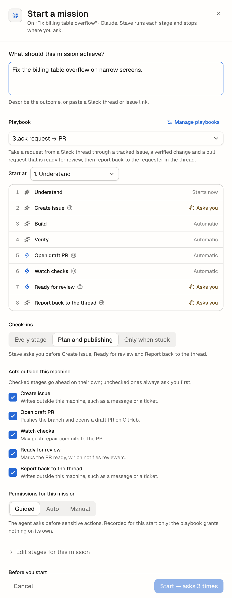
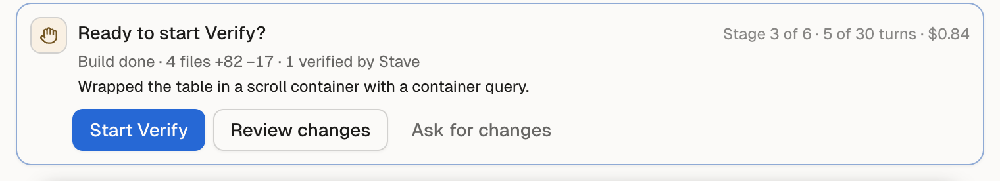
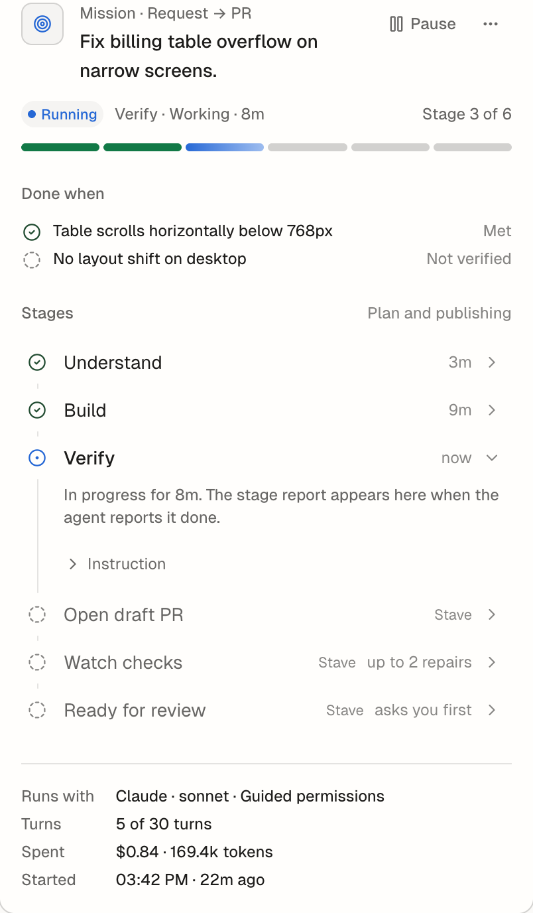

# Missions

## Summary

A mission hands one outcome to Stave. You pick a playbook and say what you
want; Stave runs the playbook's stages on the task one after another — asks
the agent for each stage, opens the draft pull request, watches its checks —
and stops only where you asked to sign off or when something needs you.

You get fewer "now verify it", "now open the PR" prompts, and a record of what
happened, why, and what proves it.

## When To Use It

- The work has a shape you repeat: understand the request, build, verify, open
  a pull request, get the checks green, request review.
- You want the task to keep moving while you do something else, and to be told
  only when it needs a decision.
- For a one-off question or a small edit, send a normal message instead. For
  scheduled work that starts a new task each time, use an
  [automation](automations.md).

## Before You Start

- The task runs on Claude or Codex.
- Stave's local tools are on (Settings → Developer → Local MCP). The agent
  reports each stage through them; without them a mission cannot start.
- For playbooks with pull request stages, the GitHub CLI is signed in
  (`gh auth login`).

## Quick Start

1. Type the outcome in the composer, for example
   `Fix the billing table overflow on narrow screens.`
2. Click **Hand off** in the composer's controls (or type `!` and pick a
   playbook shortcut).
3. In **Start a mission**, check the playbook, the stages that will ask you,
   and **Before you start**.
4. Click the primary button — it says where the mission will stop, for example
   **Start — asks before Build and Ready for review**.

The Mission bar appears above the composer and the Mission panel opens on the
right.

## Interface Walkthrough

### Entry Points

- **Hand off** in the composer controls, or `!shortcut` for a playbook with a
  shortcut.
- **Start mission…** in the command palette.
- **Start a mission** in the Mission panel of a task without one.
- **Playbook** in [Workspace Kickoff](workspace-kickoff.md) and in the
  [Issues](issues.md) kickoff sheet: Stave prepares the workspace and task,
  then opens the Start sheet on it.
- **Start mission** in a playbook's editor (Automations → Playbooks).

### Start a mission

- **What should this mission achieve?** The assignment. Paste a Slack thread
  or issue link, or describe the outcome.
- **Playbook** and its stages. Each stage says **Starts now**, **Automatic**
  or **Asks you**; a globe marks a stage that acts outside this machine.
- **Start at**: begin with a later stage when the earlier work is already
  done, for example **3. Verify** after you built the change yourself. Earlier
  stages show **Skipped**, are recorded as not run, and the button says where
  the mission starts (**Start at Verify — asks before Ready for review**).
  Starting after **Open draft PR** needs a pull request that already exists.
- **Check-ins**: **Every stage**, **Plan and publishing** (asks before the
  stage after a plan, before publishing and before requesting review), or
  **Only when stuck**.
- **Acts outside this machine**: one checkbox per stage that pushes, opens or
  updates a pull request, or writes a message or ticket. An unchecked stage
  always asks you first.
- **Permissions for this mission**: **Guided**, **Auto** or **Manual**. This
  is recorded for this start only; a saved playbook never grants permissions.
- **Edit stages for this mission**: change the stages this time only, or
  **Save as a new playbook**.
- **Before you start**: the task, a running mission, Stave's local tools, the
  GitHub CLI, an open pull request for the branch (which the mission
  continues), and uncommitted files (start on top of them only after you say
  so).

### Mission bar

Above the composer while a mission runs:

- The current stage and what it is doing — a plain phrase such as
  **Running the tests** while a turn runs, or what it waits for and for how
  long, such as **Waiting for your sign-off · 8m**.
- The stage track: one segment per stage, colored by where it stands, with the
  stage names when there is room. A hand marks a stage that asks you first.
- **Take over** pauses the mission so your replies are your own; **Resume**
  hands the task back. A reply without Take over guides the current stage and
  the mission carries on.

### Sign-off

When a stage waits for you, a card appears where tool approvals appear:
**Ready to start Verify?**, with what the previous stage produced (files
changed, evidence Stave verified) and its summary. Its corner shows the stage,
the turns used of the limit and what the mission has spent, such as
**Stage 3 of 6 · 5 of 30 turns · $0.84**.

- The primary button names what happens, such as **Start Verify** or
  **Mark ready for review**.
- **Review changes** opens Source Control.
- **Ask for changes** sends a note and runs the last AI stage again.

### Mission panel

The Mission tab in the right rail:

- The goal, a state badge (**Running**, **Needs you**, **Blocked**,
  **Stuck**, **Paused**, **Completed**), and the stage track.
- **Done when**: the acceptance criteria the agent reported, each **Met**,
  **Not met** or **Not verified**.
- **Stages** as a timeline. Open a stage for its summary, decisions with their
  reasons, evidence (**Verified by Stave** first, with **Show** to jump to the
  tool call in the transcript), links, and the instruction it ran with.
- **Retry stage** and **Skip stage** on a blocked or stuck stage; **Pause**,
  and **Cancel mission** in the **⋯** menu.
- The turn budget, with a warning close to the limit, and **Spent**: the cost
  and tokens the mission's turns used, as the provider reports them.

### Transcript

A quiet divider marks every turn a mission started, with the reason, such as
**Stage 3 · Verify** — started automatically after Build reported done.

### Mission report

When a mission ends, its report tops the Mission panel and Task Results:
outcome, figures (duration, stages, turns, verified evidence, what it spent), links,
decisions, what is still open, what was left behind, and how much the mission
needed you. **Copy Markdown**, **Add to PR description** and **Save decisions
to memory** (as memory candidates you review) act on it.

### Fleet and notifications

- A sign-off, a blocker or a stuck stage appears in Fleet's attention list with
  approvals and questions. A sign-off can be given from the row.
- Fleet cards show the mission's stage track and what it has spent, and the
  work queue puts the workspace in **Action required** or **In progress**.
- Stave notifies once when a mission asks for a sign-off, is blocked, is stuck
  or completes. **Settings → General → Mission Sign-off Reminders** sets when
  a waiting sign-off reminds you again, batched into one notification.

## Common Workflows

### Hand off from the composer

1. Write the outcome in the composer.
2. Click **Hand off**, check the sheet, and start.
3. Keep working elsewhere; answer the sign-offs from the card or from Fleet.

### Steer a running mission

- Reply in the task to add guidance; the stage continues with it.
- Click **Take over** to stop the mission's turns while you work yourself,
  then **Resume** to hand it back.

### Recover a stuck or blocked stage

1. Open the Mission panel; the stage says why it stopped.
2. Answer the question in the task, or fix what it names.
3. Click **Retry stage**, or **Skip stage** to move on.

## Files And Data

- Missions are stored in Stave's local database with their stage records and
  events. Nothing is sent anywhere except what the stages themselves do (pull
  requests on GitHub, messages through your own tools).
- The playbook is copied into the mission when it starts; later edits to the
  playbook do not change a running mission.

## Limitations And Advanced Options

- Missions run on Claude and Codex tasks, one mission per task at a time.
- A mission runs on the task's current model. If you change it, the mission
  pauses until you accept the new runtime for the remaining stages.
- Pull request stages use the GitHub CLI and watch every check reported for
  the pull request.
- **Spent** counts the turns the mission started. Claude reports a cost with
  each turn; Codex reports tokens only, so a Codex mission shows tokens. Turns
  whose provider reported nothing are counted and named, not guessed. Cache
  reads are part of the cost but not of the token count.
- A mission started at a later stage has no acceptance criteria from
  **Understand**, so its report shows only what the stages that ran reported.

## Troubleshooting

### "Reporting unavailable"

- Symptom: a stage is blocked with **Reporting unavailable**.
- Cause: Stave's local tools are off or not running, so the agent cannot
  report its stage.
- Fix: turn on Local MCP in Settings → Developer, then **Retry stage**.

### A pull request stage is blocked

- Symptom: **Open draft PR** or **Watch checks** stops with a sentence about
  GitHub.
- Cause: `gh` is signed out, the branch is protected, or the push was refused.
- Fix: follow the sentence (for example run `gh auth login`), then
  **Retry stage**.

### A stage is stuck

- Symptom: the stage says **Stuck** after the agent ended a turn without
  reporting, even after one reminder.
- Fix: read the transcript, reply with what is missing, and **Retry stage**.

## Related Docs

- [Playbooks](playbooks.md)
- [Projects](projects.md) — goals that take several missions, planned by a coordinator
- [Wake-ups](wake-ups.md) — a mission pauses its task's wake-up while it runs
- [Notifications](notifications.md)
- [Agent Platform Taxonomy](../architecture/agent-platform-taxonomy.md)
