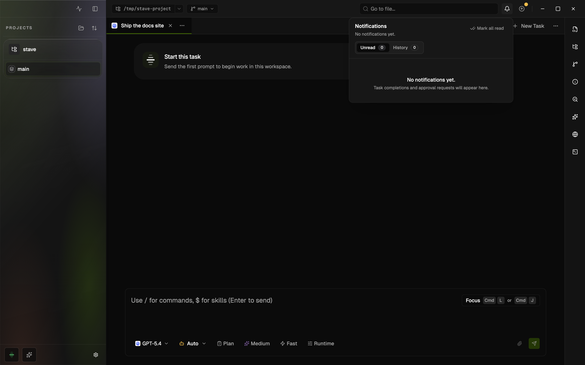

# Notifications

Stave has an in-app notification center that tracks task activity across every repository and workspace you have open, so you can step away from a task and still know when it needs you again.

The notification center lives in the top bar behind the bell icon.

## What Notifications Tell You

- A task turn finished.
- A task is waiting for your approval.
- A task needs extra input before it can continue.
- An [agent run](agent-runs.md) waits for your sign-off before a stage, is blocked or
  stuck, or finished. Clicking one opens its lead task.

Notifications stay in the app even if you close and reopen Stave, and even if the originating task has been archived.

Stave keeps the 50 most recent notifications and deletes older ones automatically. Approval and input requests that are still waiting for you are never deleted by this limit, no matter how old they are.

## Open The Center

- Click the bell icon in the top bar.
- A badge shows how many unread items you have.
- Unread items sit in the main inbox.
- Items you read move into a history view but stay available.

## Respond To Approvals

You do not have to scroll back through the task chat to approve or deny a tool call.

- Open the bell and find the approval entry.
- Approve or deny it directly from the notification.
- The change is reflected back in the task immediately.

If you prefer, the task itself also shows a pending-approval card above the composer.

## Jump Back To A Task

- Click a notification.
- Stave switches to the right repository, workspace, and task.
- If the task was archived, Stave asks you to restore it before reopening.

## Notification Sound

One short sound plays when a task turn finishes and when the AI is waiting on you (a question or an approval request). This is useful when you have a long-running task in the background and want a quick audio cue.

1. Open `Settings > General`.
2. Find `Notification Sound`.
3. Enable it, choose a preset or upload your own audio, and set the volume.
4. Click `Preview` to hear it.

## Run Sign-off Reminders

An agent run that waits for your sign-off notifies once. To be reminded again:

1. Open `Settings > General`.
2. Find `Run Sign-off Reminders` under `Desktop Notifications`.
3. Choose how long a sign-off may wait (`After 15 minutes` to `After 2 hours`,
   or `Never`).

Every sign-off that has waited that long is reminded in one batched
notification, not one per agent run.

## Tips

- Use the notification center instead of keeping every task view open side by side.
- Mark approvals `Deny` from the center if you want to stop a long agent without losing the current task.
- If you switch devices or restart Stave, notification history comes back with you.

## Troubleshooting

### I Never See New Notifications

- Symptom: the bell stays at zero even though a task just finished.
- Cause: the turn never fully completed, so the workspace is still responding.
- Fix: look at the task; if the indicator is still animating, the turn is not yet considered finished.

### Clicking A Notification Does Nothing

- Symptom: selecting an entry does not navigate anywhere.
- Cause: the task was archived.
- Fix: Stave asks you to restore the task before reopening it. Accept the restore prompt.

### The Sound Does Not Play

- Symptom: turns finish, or the AI asks for input, but no sound plays.
- Cause: the sound is disabled or the volume is set to zero.
- Fix: open `Settings > General > Notification Sound`, enable it, raise the volume, and click `Preview`.

## Related Docs

- [Fleet Action Required](fleet-needs-me.md)
- [Runtime Safety Controls](provider-sandbox-and-approval.md)
- [Latest Turn Summary](workspace-latest-turn-summary.md)
- [Command Palette](command-palette.md)
- [AgentRuns](agent-runs.md)
