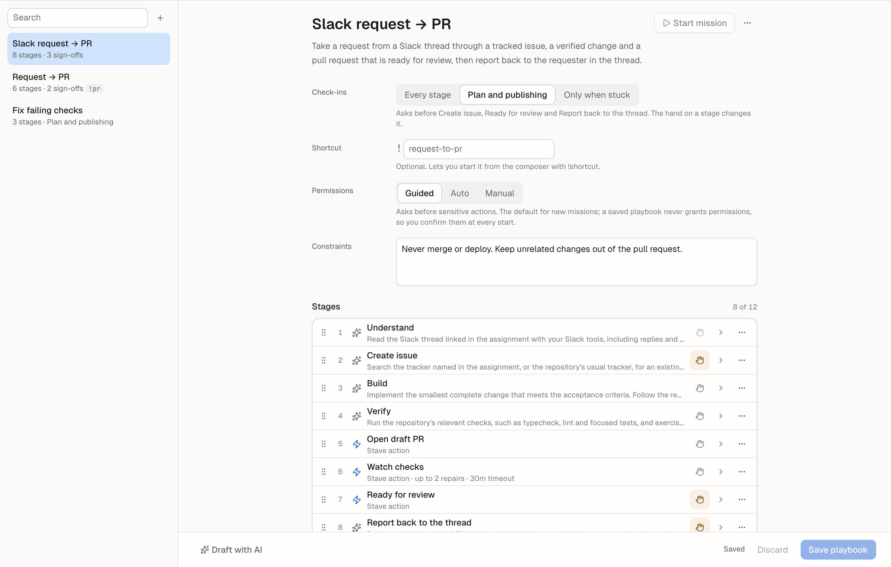

# Playbooks

## Summary

A playbook is a saved way of working: the stages you would otherwise prompt one
by one, each with an instruction and a condition that says when it is done.
Start a [mission](missions.md) with it and Stave runs the stages for you. A
[project](projects.md)'s coordinator picks from the same playbooks.

## When To Use It

- You repeat the same sequence — understand, build, verify, open a PR, fix
  checks, request review — and want to hand it off in one step.
- Your team has a way of working worth writing down once.
- For a single saved prompt, use a macro instead.

## Before You Start

- Playbooks are edited on the **Agents** surface, **Playbooks** tab. Missions
  they start need a Claude or Codex task and Stave's local tools (see
  [Missions](missions.md)).

## Quick Start

1. Open **Automations** and choose the **Playbooks** tab.
2. Pick a template such as **Request → PR**, or **Blank playbook**, or
   **Draft with AI**.
3. Adjust the stages, then **Save playbook**.
4. Give it a **Shortcut** such as `pr` to start it with `!pr` from the
   composer.

## Interface Walkthrough

### Entry Points

- Agents → **Playbooks**.
- **Manage playbooks** in the command palette and in the Start mission sheet.

### Editor

- **Name** and **Purpose** head the editor; click to edit in place.
- **Check-ins** chooses where missions ask you: **Every stage**,
  **Plan and publishing** or **Only when stuck**. The sentence under it names
  the stages that ask. Changing a single stage's hand marks the check-ins
  **Custom**; choosing a preset resets them.
- **Shortcut** lets you start the playbook with `!shortcut` in the composer.
- **Starts when** lets the playbook propose missions by itself (see
  [Start conditions](#start-conditions)).
- **Permissions** is the default the Start sheet preselects: **Auto** unless
  you choose otherwise, since missions already stop at sign-offs and at the
  steps you did not allow. It grants nothing by itself; every start confirms
  its own permissions.
- **Constraints** are rules every stage follows.
- **Stages**: each row has a handle, its number, its kind (AI stage or Stave
  action), its name, a preview of its instruction, and a hand that says whether
  a mission asks you before it.
  - Drag the handle, or focus it and press **Alt+↑/↓**, to reorder.
  - Open a row to edit its **Instruction**, **Done when** and **Role**
    (**Plans** or **Publishes**, which the check-ins use).
  - Stave actions have their own settings: **Watch checks** takes a number of
    repairs and a time limit; **Run script** takes the id of a script action.
- **Add stage** offers a blank AI stage, stage templates and the four Stave
  actions: **Open draft PR**, **Watch checks**, **Ready for review** and **Run
  script**.

### Flow

Under the stages, **Flow** shows the playbook as the mission will run it: who
does each stage (the mission's task, another agent, or Stave), where it asks
you first, what it does outside the workspace, and which stages are pinned to
a commit. It is read-only and updates as you edit; a draft from **Draft with
AI** shows there before you save.

### Stages another agent does

An AI stage's **Done by** picks who does it: **This mission's task** (the
default), or an agent usable as a delegated task. For an agent, the mission's
task delegates the stage to a delegated task running as that agent, waits for
it, and reports the stage from its result. The mission's task keeps its own
provider and instructions throughout.

Turn on **Work on the commit checked out when it starts** for a review stage:
the mission's task commits first, and Stave refuses to start the review if the
workspace has moved off that commit, so the review never reports on a later
change.

### Run script

A **Run script** stage runs an action from the workspace's scripts
(`.stave/scripts.json`, edited in Settings → Repositories → Scripts), such as
a preview deployment, and waits for it — up to 30 minutes.

- Pick the script by its id; the scripts of the workspace in view are offered
  below the field. Each mission runs its own workspace's script of that id.
- The stage fails when the script exits with an error, with the end of its
  output. The last web address it prints, such as a preview URL, becomes
  **Verified by Stave** evidence and a link in the report.
- It counts as acting outside this machine, so the Start sheet asks for your
  consent to run it without asking first.
- A script that was running when Stave stopped is not run again: the stage
  fails and says so, and **Retry stage** runs it anew.

### Start conditions

**Starts when** lists what proposes a mission with the playbook. Proposed
missions wait in [Issues → Proposed](issues.md#proposed-missions) for you to
start or dismiss them.

- **An issue is assigned to me** — for each issue newly assigned to you in
  Issues (Crane or Jira), optionally only those matching a label, project or
  key. Issues assigned before you turned it on, or before you changed the
  filter, are left alone. Starting one opens the ticket's kickoff with this
  playbook chosen, so you pick its workspace.
- **A workspace's pull request needs work** — when checks fail, changes are
  requested, or both, on the pull request of a workspace in the open
  repository, while Stave is open. Once per commit, and only in a workspace no
  other mission works in; a pull request that arrives while one does is
  checked again after that mission ends.
- **On a schedule** — every day, weekdays, Mondays at 09:00 or every 4 hours,
  in this computer's time, in the workspace in view when you turned it on. A
  time that passed while Stave was closed or the computer slept is proposed,
  never started late.
- **Start on its own** — pull request and scheduled missions start without
  asking, on a new task in their workspace. One switch covers both
  conditions; turning on a schedule turns it on only when pull requests are
  not watched. At most one mission starts in a workspace at a time: when
  several conditions fire together, the rest wait in Proposed. They run with
  the playbook's permissions and allow none of the steps that act outside this
  machine: stages that publish, open pull requests or run scripts still wait
  for you. A playbook whose first stage publishes
  always waits, and a mission that cannot start waits with the reason.

Issues keep refreshing in the background, every 10 minutes, while a playbook
watches for assigned issues. Pull requests are read as the workspace's PR
status updates. A mission that starts on its own shows under **Decided
recently** in Proposed with a link to it. Start conditions keep working after
Stave's background service restarts.

### Draft with AI

Describe how you work in a sentence, or paste an example of the steps you took
last time, and click **Draft stages**. The draft replaces the editor's content
but is not saved until you click **Save playbook**. **Cancel**, closing the
panel or opening another playbook stops a draft in progress; a late answer
never replaces what you edited since.

### Results

How missions went per playbook is on the **Results** page (see
[Missions](missions.md#results)).

## Common Workflows

### Make a playbook from a template

1. Agents → Playbooks → **+** → **From a template**.
2. Edit the stages and save.

The templates cover pull requests — **Request → PR**, **Slack request → PR**,
**Fix failing checks**, **Address review** — and work that is not one:
**Research a question**, **Draft a decision document**, **Investigate a
problem** (changes no files), **Plan, build and verify**, **Coordinate
independent tasks** (through delegated tasks) and **Independent review**.

**Triage requests** reads where requests reach you — the places its assignment
names, otherwise your Slack mentions and tickets assigned to you — and proposes
a mission for each one worth doing with `stave_propose_mission`. It proposes
only; it never replies or starts work. Give it a schedule under **Starts
when** to triage every morning.

### Save a playbook from a finished mission

In the Mission report, choose **More → Save as playbook**. The playbook the
mission ran — with any stage edits you made for that run — is saved under its
own name. A mission that ran a saved playbook unchanged only names it.

### Change a playbook for one mission

In the Start mission sheet, open **Edit stages for this mission**. Leave
**Save as a new playbook** off to change it this time only.

## Files And Data

- Playbooks are part of Stave's settings on this machine. A mission copies the
  playbook when it starts.
- Saving validates the whole playbook: each missing field is shown next to the
  field, and an issue without a field of its own (such as a start condition)
  is listed in the banner above the editor. A playbook opens a draft PR at
  most once, and **Watch checks** and **Ready for review** come after **Open
  draft PR**.
- Unsaved edits stay while you switch playbooks or Agents tabs, until you
  save or discard them or quit Stave.
- **Duplicate** copies the stages and settings but not the shortcut or the
  start conditions, so the copy never proposes the original's issues again.
- A saved playbook this version of Stave cannot read (saved by another
  version) is kept aside unchanged, and the Playbooks tab says how many. It
  comes back once a version that reads it opens it.

## Limitations And Advanced Options

- Up to 50 playbooks, each with up to 12 stages. With 50 saved, the Playbooks
  tab adds no new, template or duplicate playbook until you delete one.
- Playbooks are not shared through the repository yet.

## Related Docs

- [Missions](missions.md)
- [Automations](automations.md)
- [Projects](projects.md)
