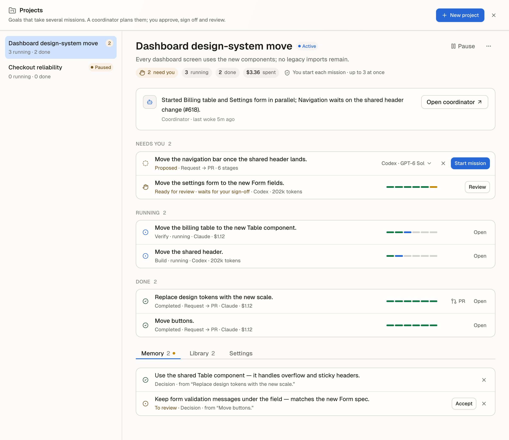

# Projects

## Summary

A project takes a goal that needs several missions — moving a set of screens,
a migration, a feature in parts. Its coordinator, a Claude or Codex task,
breaks the goal into missions, starts each one on its own worktree once you
approve it, reads their reports when they end and proposes what comes next.

You brief the goal once and then approve, sign off and review. The coordinator
never edits files; the work happens in [missions](missions.md).

## When To Use It

- The goal splits into pieces that can run side by side or one after another,
  each a mission of its own.
- You want one place that shows what needs you, what runs and what is done
  across those missions.
- Decisions made in one piece should carry into the next ("use the shared
  Table component").
- For a single outcome, start a [mission](missions.md) directly. For
  scheduled work, use an [automation](automations.md).

## Before You Start

- Stave's local tools are on (Settings → Developer → Local MCP). The
  coordinator reads the project and starts missions through them, and each
  mission reports its stages through them.
- The coordinator runs on a Claude or Codex task: a new one, or the task in
  view.
- The playbooks the coordinator may pick are your saved playbooks and the
  starter templates (Agents → Playbooks).

## Quick Start

1. Open **Projects** in the sidebar (or **New project…** in the command
   palette).
2. Click **New project**, name it and say what done looks like in **Goal**.
3. Pick the **Coordinator**: **New Claude task**, **New Codex task** or
   **Task in view**. Leave **Ask before starting each mission** on.
4. Click **Create and plan**. The coordinator reads the goal and proposes
   missions (a task in view that is answering plans once that turn ends).
5. In **Needs you**, check each proposal's playbook and click **Start
   mission**. Each one starts on a new worktree.

## Interface Walkthrough

### Entry Points

- **Projects** in the sidebar, under Fleet View, with each open project and
  the number of things that need you. With the sidebar collapsed, the
  Projects icon on the rail has a dot when something needs you.
- **Open projects** and **New project…** in the command palette.
- The project count in the Fleet View header.
- The Information panel of the coordinator's workspace and of every mission
  workspace: a card names the project, what needs you, and opens the project
  or its **Library**.

### Projects view

Every project is on the left, open ones first, then **Ended**. The one in
focus is on the right. On a narrow window a picker replaces the list.

### Project home

- **Header**: the name, the state (Active, Paused, Completed, Cancelled,
  Expired) and
  the goal, then chips for what needs you, what runs, what is done and what
  the project's missions have spent, and how missions start ("You start each
  mission · up to 2 at once") and what it watches ("Issues matching
  “dashboard” · PR feedback · Weekdays at 09:00"). **Pause**
  stops the coordinator's automatic turns and new starts; the ⋯ menu marks
  the goal met or cancels the project (after you confirm; a cancelled project
  cannot be reopened).
- **Coordinator**: its latest summary of the project, and when and why it
  last woke ("woke 5m ago for an assigned issue"). **Talk** opens the
  conversation; **↗** opens its task.
- **Needs you**: proposals waiting for **Start mission** or **×** (dismiss),
  and missions that wait for your sign-off or are blocked or stuck
  (**Review**). A proposal shows where it will run, such as **Codex · GPT-6
  Sol**; open it to pick another provider or model before starting.
- **Not started** (only when there is something to show): approved missions
  **Queued** until one of the project's slots frees up, and starts that
  failed, each with the reason Stave kept (the newest three; older ones are
  counted).
- **Running** and **Done**: each mission with its playbook, current stage,
  provider, what it spent and a stage track. **Open** goes to its task; **PR** opens its
  pull request.
- **Memory**: decisions from finished missions and the coordinator's notes.
  **Accept** a decision to have later missions follow it; **×** removes it.
- **Library**: pull requests, issues, previews and documents from mission
  reports, with **Verified** on links Stave produced itself. Search by name,
  mission, address or kind ("pr", "preview").
- **Starts when**: what wakes the coordinator besides its missions (see
  below).
- **Settings**: **Missions at once** (1–4), **Ask before starting**, **End
  date** and **Accept decisions automatically**.

### Coordinator conversation

The coordinator's conversation sits beside the project when the window has
room — to the right of the project, with the project list still on the left
on a wide window — and floats over it on a narrow one (**Talk** opens it, **×**
hides it).

- It shows what you wrote, the coordinator's answers, and one line for each
  time Stave woke it ("Woke the coordinator: Issue assigned to the user:
  ACME-12 · Fix login"). Tool calls stay in the task.
- Write in **Message the coordinator** and press Enter (Shift+Enter for a new
  line). The message starts a turn on the coordinator's task, read-only like
  every coordinator turn. While it answers, the box waits.
- The header shows whether it is **Idle** or **Answering** and the provider
  and model it runs on.

### Starts when

Each start condition wakes the coordinator, which decides whether a mission
follows; with **Ask before starting** on, you still approve every mission.

- **An issue is assigned to me**: a new issue in [Issues](issues.md) (Crane
  or Jira). Optionally only issues whose key, title, project or labels match a
  word, such as a label. Issues assigned before you turn this on or change
  the word are left alone. While a project watches, Stave refreshes Issues in the background
  every ten minutes or at your Issues refresh interval, whichever is longer.
- **A mission's pull request gets feedback**: failing checks, requested
  changes or a merge on a pull request one of the project's missions opened.
  Checked every five minutes, once per new commit, for two weeks after the
  mission ends. On by default.
- **Scheduled check-in**: every day, weekdays or Mondays at 09:00, or every
  four hours, in this computer's time. The coordinator reviews where the
  project stands and plans the next step.

Conditions that fire while the coordinator is in a turn wait and arrive
together in its next one, and they count toward the 24 automatic turns a
day.

### Agents

The **Agents** setting chooses which saved agents the project uses. Off, any
agent. On, only the ticked ones: the coordinator is told which, a mission it
proposes may run its task as one of them (the proposal shows **runs as**), and
delegations from the project's tasks may only name them. A mission whose
agent is outside the list, or cannot run a task, is refused before anything
starts. The mission's task keeps that agent, with its instructions and
permission limit, for the whole mission.

## How The Coordinator Works

- It wakes when a mission of the project ends, waits for your sign-off, or is
  blocked or stuck — never on every stage. Changes that land while it is in a
  turn wait and arrive together in its next turn.
- Each wake prompt names the missions and their one-line summaries. The
  coordinator reads full reports with `stave_get_mission_report`, starts work
  with `stave_start_mission`, and records what it learned or a new summary
  with `stave_note_project`. `stave_get_project` and `stave_list_missions`
  show the project. These tools exist only in the coordinator's turns.
- With **Ask before starting** on, `stave_start_mission` creates a proposal
  you approve. With it off, missions start on their own up to **Missions at
  once**.
- The coordinator picks each mission's provider and may name a model from the
  list `stave_get_project` returns; without one the mission runs on the
  provider's default model. The mission's new task opens on that model.
- The coordinator's turns are read-only: Claude cannot edit files and Codex
  runs read-only.
- After 24 automatic turns in a day, the project pauses and tells you;
  **Resume** lets it continue and starts the count over.

## Common Workflows

### Run two pieces in parallel

Set **Missions at once** to 2 or more. Approve both proposals; each starts on
its own worktree, on the provider and model the coordinator chose for it —
or the one you picked on the proposal.

### Carry a decision into later missions

When a mission ends, its reported decisions appear in **Memory** as **To
review**. **Accept** the ones that should hold. Every later mission of the
project receives accepted memory as context; missions outside the project
never do. Turn on **Accept decisions automatically** to skip the review.

### Coordinate existing tasks

Use **Linked tasks → Link a task** to reference ordinary tasks from the same
repository. Choose their dependencies to make the integration order visible.
Links do not start work, change permissions, or block a task from running on
its own. Missions keep their existing proposal and sign-off flow.

Choose a linked task as the **Integration owner** and record the combined
result, acceptance criteria, evidence references and unresolved items. A
finished task run or an agent report alone does not accept integration. Review
the evidence, mark every criterion met and choose **Accept combined result**.
Missing, archived or running tasks and unresolved items prevent acceptance.
The review records the current work revision, including HEAD, staged changes
and bounded dirty/untracked file contents when they can be read. Later task,
mission, commit or file changes
make it outdated and require another review. Linked tasks remain references:
their transcripts and execution permissions are not shared with the coordinator.
If file state cannot be verified, Stave says so and records a review of task
records and your evidence. Document and question tasks can still be reviewed
without adding a code-verification requirement.

### Finish a project

When the goal is met, choose ⋯ → **Mark the goal met**. Running missions
continue on their own; the coordinator stops waking.
When ordinary tasks are linked, first accept the current combined result in
**Integration**. Successful individual runs do not complete the project.

## Files And Data

- Projects, proposals, project events and memory live in Stave's local
  database, next to missions. A project's missions are ordinary missions that
  record their project.
- Saved playbooks come from your settings; Stave hands them to the host so
  the coordinator can pick them.

## Limitations And Advanced Options

- The coordinator edits no files; it plans and follows.
- **Spent** adds up what the project's missions report (see
  [Missions](missions.md)); the coordinator's own turns are not included.
- Quitting Stave pauses every active project ("Stave was closed while this
  project was active"); relaunching resumes exactly those. Missions resume
  where they were, a start that was interrupted halfway is marked failed
  instead of being started twice, and a scheduled check-in missed while Stave
  was closed does not fire late. A project you paused yourself stays paused.
- With an **End date**, the project expires at the end of that day: it stops
  waking its coordinator and starting missions, and tells you. Running
  missions finish on their own.
- Start conditions only wake the coordinator; they never start a mission on
  their own unless **Ask before starting** is off.
- Pull request feedback reads the PR of each mission's own branch through the
  GitHub CLI; review comments without a requested-changes review do not wake
  it.

## Troubleshooting

### The coordinator does not wake

Check that the project is **Active** (a paused project shows why under its
goal), that the coordinator task still exists and is not archived, and that
Local MCP is on. A wake that fails to start is reported once, not retried in
a loop; send the coordinator a message or **Resume** the project.

### A proposal shows as failed

Stave could not create the worktree or start the mission. The proposal keeps
the reason, shown under **Not started**. Ask the coordinator to propose it
again; the same start is never replayed on its own.

### Projects could not be loaded

The Projects view shows the reason and **Try again** instead of the first-run
page when the project list (or one project) cannot be read. Try again; if it
keeps failing, restart Stave.

## Reproducible Evaluation

Compare runs on the same repository revision, task class, model, permission
policy and acceptance criteria. Keep a baseline fixture and reset the worktree
between runs; record the run/turn IDs and evidence references.

| Path | Check before calling the result accepted |
| --- | --- |
| Direct task | Compare its completion receipt with the explicit criteria and unresolved items. |
| Agent task | Repeat the direct-task checks and record the selected agent/runtime configuration. |
| Delegation | Review the child result separately from the parent's combined result; record each approval or question and its reason. |
| Mission | Check stage evidence, required sign-offs, and whether later workspace changes invalidate acceptance. |
| Project integration | Confirm linked work, dependencies, integration owner, current snapshot, evidence source and separate user review. |

For each run, record criteria met/unmet/unverified, false completion (a claimed
completion with unmet or unverified criteria), explicit user correction,
approval/question reason, elapsed time and provider-reported cost. An ordinary
follow-up is not automatically a correction. Unknown cost stays unknown:
`Spent` aggregates reported mission costs, so a mixed-provider amount can be
a partial known total; the coordinator and linked ordinary tasks are outside
that total. Compare cost only alongside its measured/unreported coverage.

The existing project limits cover concurrent mission starts and automatic
coordinator wakes in the last 24 hours since resume; they are not a dollar
budget. Triggers are deduplicated, and task links start no work. Mission
decisions become memory candidates until accepted, unless the user enabled
automatic acceptance. There is no aggregate improvement score or automatic
intervention-quality counter; derive evaluation rows from the recorded events
and reviewed evidence instead of inventing improvement statistics.

Focused reproducible checks: [integration contracts](../../tests/project-task-integration.test.ts),
[workspace freshness](../../tests/workspace-revision.test.ts),
[wake budget](../../tests/project-policy.test.ts),
[trigger deduplication](../../tests/project-triggers.test.ts),
[memory approval](../../tests/project-memory-library.test.ts), and
[reported usage](../../tests/mission-usage.test.ts).

## Related Docs

- [Missions](missions.md)
- [Playbooks](playbooks.md)
- [Fleet Action Required](fleet-needs-me.md)
- [Sidebar Views](sidebar-views.md)
