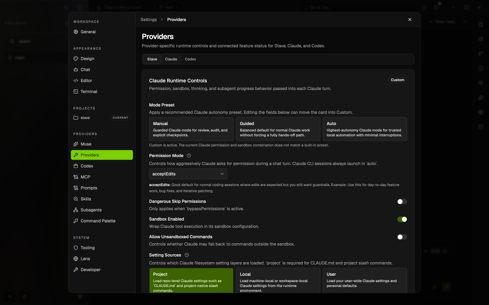
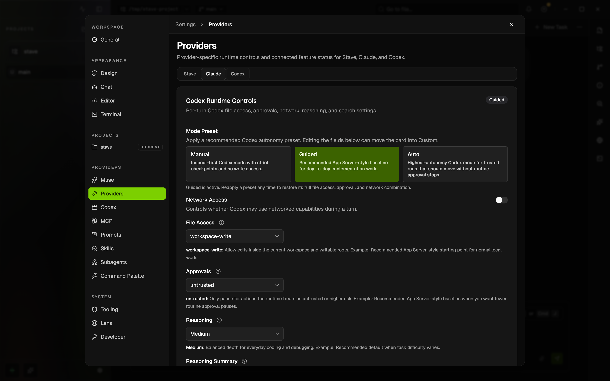

# Provider Sandbox And Approval Guide

Stave lets you choose how much freedom Claude or Codex gets before a turn starts.

This example shows the Claude runtime controls inside Settings.

This example shows the Codex runtime controls for file access, approvals, and network behavior.

## What This Guide Helps You Decide

- whether the provider can edit files
- whether it should stop for approval
- whether network access should stay off
- whether the next turn should stay in planning mode

These controls are product-facing workflow settings. They are the fastest way to move between review-only work, normal edits, and more autonomous local automation.

## Where To Find The Controls

1. Open `Settings`.
2. Go to `Providers`.
3. Choose the `Claude` or `Codex` tab.
4. Review the preset and the individual runtime controls before sending the next turn.

You can also confirm the effective state from the runtime chips near the composer.

## Per-project defaults

Settings normally apply to every project. A few defaults can differ for one
project:

- the default model and effort for Claude, Codex, Cursor and Kiro (`Models`);
- the permission posture for each provider (`Providers`): Claude's permission
  mode and sandbox switches, Codex's file access, network access and approvals,
  and the Cursor and Kiro approval presets.

Nothing else can be overridden per project.

1. Open `Settings`.
2. At the top, change `Applying settings to` from `All projects` to the project.
   Search for "project" or "scope" in the settings search to jump there.
3. Go to `Models` or `Providers`. Each control you can set for the project shows
   `Global value` or `Project value`; `Use global value` removes the project's
   value. Other controls, and every other section, apply to all projects and
   stay read-only while a project is selected.

New tasks and turns in that project start from its values. A model, effort or
mode you pick in the composer for a task still wins over both. Removing the
project from Stave removes its overrides.

## Second opinions

A second opinion is a read-only subagent: ask the agent for one, and it calls
`stave_delegate_task` with `access: "read-only"`, which never edits files or
asks for approval and returns the answer inline. See
[Delegated tasks](delegated-tasks.md#read-only-consults).

## Recommended Starting Points

### Review Or Planning Work

- prefer a guarded preset
- keep network off unless the task explicitly needs it
- use Codex `read-only` when you need strict no-write behavior

### Normal Day-To-Day Edits

- use the default guided or workspace-write style setup
- allow edits in the current repository
- keep approvals on if you still want a checkpoint before higher-risk actions

### Trusted Local Automation

- only use the most permissive preset when you trust both the task and the working directory
- verify the runtime chips before sending

## Autonomy And Guardrails

Every turn gets one of three postures, resolved once when the turn starts —
composer turns, agent tasks, delegated helpers, agent runs, wake-ups and tasks
started through Local MCP alike:

| Posture | When | What it means |
| --- | --- | --- |
| Ask | Your preset prompts (Claude Default, Accept Edits; Codex Untrusted, On Request) | Your settings exactly, with their prompts |
| Autonomous | Claude **Auto** or **Bypass**, Codex **Never**, or the task runs as an agent | No routine approval prompts; only the agent's questions and, in Agent mode, the guardrails stop the turn |
| Read only | A read-only agent or a read-only delegation | Never writes, never asks |

Autonomy only removes prompts. Your sandbox, deny lists, credential lists and
network setting stay as you set them. Commits, pushing a feature branch,
opening, updating and merging pull requests, tests and installs inside the
workspace all run without asking.

Stave guardrails apply **only in Agent mode**: a task that runs as an agent,
the helpers and agents it delegates on either provider, and the tasks it starts
through Local MCP. They are **all on by default** there; turn each
one off in **Settings > Providers > Claude**. One that is on stops for you even
under Bypass. A chat turn (model mode) never runs them, whatever its
permission mode, so it behaves as it did before guardrails existed. Everyday
agent work (edits in the workspace, its sibling worktrees and the main
checkout, commits, pushing a feature branch, pull requests) never trips them:

- **G1** a write outside the task's repository. The workspace, the repository's
  main checkout, every worktree git reports for it (including
  `../.worktrees/<repo>`, where the worktree PR flow creates them), temp
  directories, `~/.cache`, `~/Library/Caches`, Claude's own `projects` and
  `plans` folders, and a handoff plan in another Stave workspace's
  `.stave/context/plans` stay allowed
- **G2** reading or writing a protected credential path or variable: your
  sandbox credential lists plus well-known locations such as `~/.ssh`, `~/.aws`,
  `~/.gnupg`, `~/.netrc`, `~/.git-credentials` and `~/.npmrc`
- **G3** an irreversible remote action: force-pushing a default or protected
  branch (`main`, `master`, `trunk`, `develop`, `production`, `release/*` or the
  repository's default), deleting remote branches or tags, deleting or
  publishing releases, deleting a repository, publishing a package, `sudo`
- **G4** the agent's own questions always reach you; this one is not a setting

A guardrail shows up as an ordinary approval with the reason. Of G1-G4 only
G4 also applies outside Agent mode. A helper never
gets more autonomy than the task that delegated it, and no agent can answer
another task's approval.

How firmly each provider holds them:

- **Claude** holds the G1–G3 that are on with a hook that runs before the
  permission mode, so they apply under Bypass. A chat turn, or an agent with
  all three off, gets no hook. Shell commands are matched literally: a path behind
  a variable or inside a script is bounded by the sandbox when you turn it on,
  not by the guardrail.
- **Codex** holds G1 with its workspace-write sandbox and G4 natively. It has no
  per-turn hook, so G2 reads and G3 are not stopped by Stave: with network on, a
  Codex turn that never asks can push or publish. Keep network off, or use
  Codex's own approvals, when that matters.
- **Cursor and Kiro** keep your settings; only a read-only agent changes them.

## Provider Differences

### Claude

Claude focuses its safety model around permission mode and sandbox behavior.

Use Claude controls when you want to decide:

- how often Claude should ask for permission
- whether sandboxing should stay on
- whether sandbox escape should be allowed

In `Auto`, Claude's own classifier decides most calls. When it is unavailable
for your model or plan, Claude asks instead, and the turn says so once. Reads
and searches still run without asking, except reads of protected credential
files and calls your own ask rules cover. Shell commands and other actions ask.

### Codex

Codex exposes file access and approvals as separate controls.

Use Codex controls when you want to decide:

- `read-only` versus `workspace-write`
- whether approvals should stay on
- whether network access should remain off
- whether the turn should stay in planning mode

### Cursor

Cursor exposes approval autonomy as a single Approval Preset, because its CLI
takes the setting as a process flag for the whole session rather than per tool
call.

- `Manual`: Cursor asks before every tool call.
- `Guided`: Cursor's own Auto-review classifier runs the calls it judges safe
  and asks for the rest. Cursor decides which calls those are, so Stave cannot
  list them in advance.
- `Auto`: Cursor runs every tool call and trusts MCP servers without asking.

Cursor has no separate sandbox control in Stave. Choose the read-only `ask`
session mode in Cursor settings when a turn should only answer.

### Kiro

Kiro exposes the same Approval Preset with two tiers.

- `Manual`: Kiro asks before every tool call.
- `Auto`: Kiro auto-approves every tool permission request.

There is no partial-trust tier: Kiro's CLI accepts unknown tool names for a
partial grant without reporting an error, so Stave does not offer a setting it
cannot verify.

## Quick Start

1. Open `Settings → Providers`.
2. Pick the provider you are about to use.
3. Start from a preset instead of changing every field individually.
4. Confirm the effective runtime chips near the composer.
5. Send a small, harmless turn first if you are testing a new configuration.

## Common Workflows

### I only want inspection

1. Choose Codex.
2. Set file access to `read-only`.
3. Keep approvals on if you want explicit checkpoints.
4. Send the turn.

### I want normal repo edits

1. Choose the provider you prefer.
2. Start from the normal guided preset.
3. Make sure the next turn is allowed to work in the repository, but not beyond it.
4. Confirm the runtime chips before sending.

### I want a plan before any edits

Stave has no plan mode; ask for the plan in the prompt.

1. Write the request as a plan, for example
   `Write a plan for the retry change as a document; do not edit code yet.`
2. The agent writes it as a document and replies with a short summary. Read or
   edit the document, then ask for changes in the next message.
3. When the plan is right, send `Implement the plan.`

For a turn that must not edit anything, pick a read-only setup instead: Codex
`read-only` file access, or the read-only Researcher agent. See
[Workspace Documents](workspace-documents.md).

### I need more autonomy for a trusted local task

1. Choose Claude **Auto** (or **Bypass**) or Codex **Never**, or run the task as an agent.
2. Recheck sandbox, file access, and network settings; autonomy keeps them as set.
3. Only then send the turn. In Agent mode the guardrails that are on still stop for you.

## Troubleshooting

### The provider is still read-only

- Symptom: you expect edits, but the runtime display still shows read-only behavior.
- Cause: the provider is using a guarded preset or `read-only` file access.
- Fix: pick a preset that allows edits and confirm the effective runtime chips again.

### Claude refuses a command I expected it to run

- Symptom: Claude stops or asks for permission earlier than expected.
- Cause: the current permission or sandbox settings are more restrictive than the task needs.
- Fix: loosen the runtime settings only if you trust the task and the working directory.

### I am not sure what will happen before I send

- Symptom: you changed settings but are unsure which ones actually apply.
- Cause: multiple controls are active at once.
- Fix: rely on the composer-side runtime chips and send a low-risk prompt first.

## Related Docs

- [Repository Instructions](repository-instructions.md)
- [Local MCP](local-mcp-user-guide.md)
- [Install Guide](../install-guide.md)
