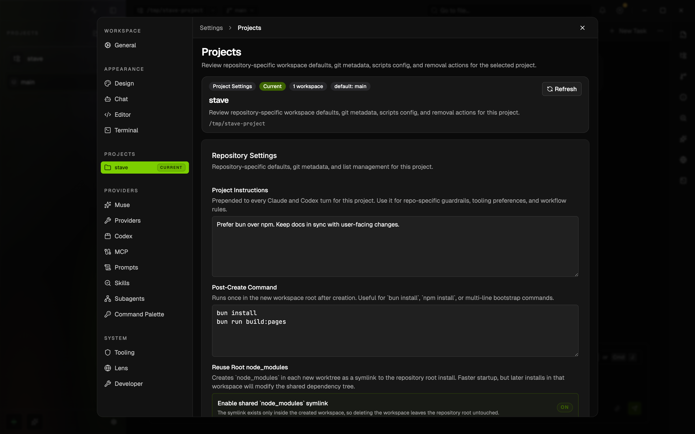

# Repository Instructions

## Summary

- `Settings → Repositories` now includes a per-repository `Repository Instructions` field.
- Stave prepends this text to every Claude and Codex turn for the selected repository so repository-specific rules do not need to be repeated in each task.



This rendered example shows the `Settings → Repositories` section with repository-level instructions, workspace bootstrap settings, and repository defaults in one place.

## When To Use It

- Use it when one repository has durable AI guidance such as tooling preferences, review rules, or architectural constraints.
- Use prompt-level instructions instead when the rule applies only to one task or one conversation.
- Use global prompt settings when the same formatting rule should apply across every repository.

## Before You Start

- Open a repository in Stave so it appears under `Settings → Repositories`.
- Keep the text short and durable. This field is best for stable repository rules, not temporary task notes.

## Quick Start

1. Open `Settings`.
2. Go to `Repositories` and select the repository.
3. Add text in `Repository Instructions`.
4. Save the field and send a normal Claude or Codex turn in that repository.

## Interface Walkthrough

### Entry Points

- `Settings → Repositories`
- The per-repository `Repository Settings` card

### Key Controls

- `Repository Instructions`: repository-level guidance prepended to every Claude and Codex turn in that repository
- `Post-Create Command`: worktree bootstrap command for new workspaces
- `Reuse Root node_modules`: shared dependency install toggle for new workspaces

## Common Workflows

### Create Or Configure Something

1. Select the repository in `Settings → Repositories`.
2. Enter rules such as package manager preference, test requirements, or documentation policy.
3. Save the field. The value is persisted with that repository's local Stave registry entry.

### Run Or Verify Something

1. Send a new task message in the same repository.
2. Ask the model to follow a rule covered by the saved repository instructions.
3. Confirm that the response follows the saved repository guidance without restating it in the user prompt.

## Files And Data

- The value is stored in the recent-repository registry entry for that repository.
- It is applied at turn runtime as the base prompt context for both providers.

```json
{
  "repositoryPath": "<workspace>/my-repo",
  "repositoryBasePrompt": "Prefer bun over npm. Keep docs in sync with user-facing changes."
}
```

## Limitations And Advanced Options

- The field is repository-scoped, not workspace-scoped. Every workspace under the same repository shares the same instructions.
- If you need one-off behavior for a single request, put that instruction in the task prompt instead.

## Troubleshooting

### The model ignored a repository rule

- Symptom: a new turn does not follow a rule saved in `Repository Instructions`.
- Cause: the instruction was saved under another repository entry, or the current task is attached to a different repository.
- Fix: open `Settings → Repositories`, confirm the selected repository path, and verify the text is saved on that exact repository.

### The instruction keeps changing model output too broadly

- Symptom: unrelated tasks start over-constraining their responses.
- Cause: the saved prompt contains task-specific guidance instead of durable repository rules.
- Fix: shorten the field to stable repository-wide rules and move temporary directions back into the task prompt.

## Related Docs

- [Provider sandbox and approval guide](provider-sandbox-and-approval.md)
- [Local MCP user guide](local-mcp-user-guide.md)
- [Workspace Scripts](workspace-scripts.md)
