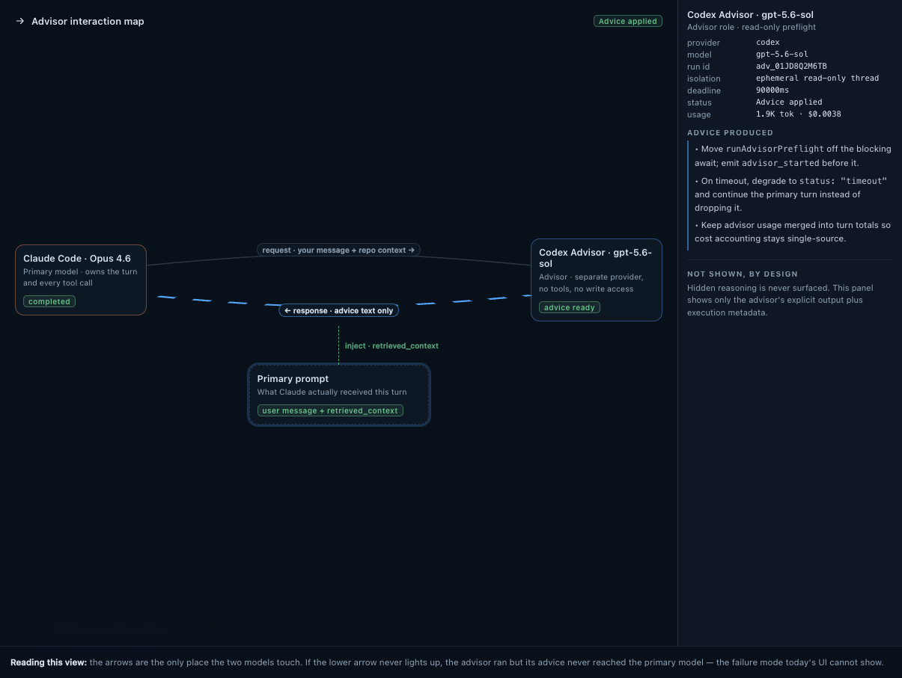
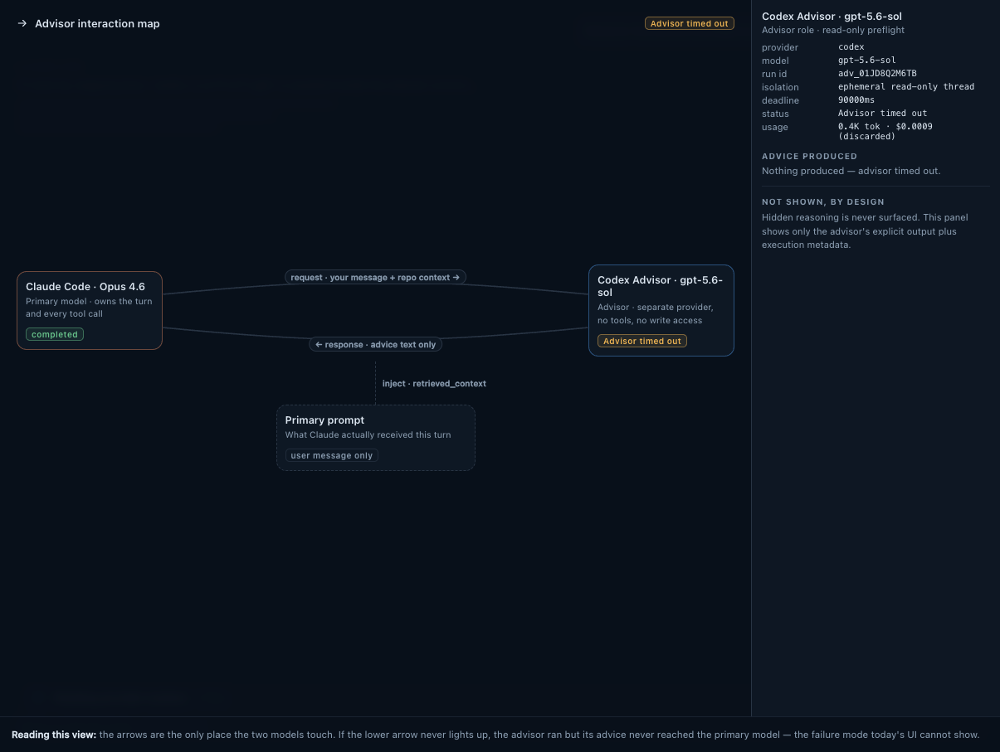

# Advisor Interaction Map

Status: **proposed / not implemented — partially superseded**

> ⚠️ This plan was drawn for the preflight-era Advisor (one blocking call
> before the turn, advice injected into the primary prompt). The Advisor has
> since become **on-demand**: the primary consults it mid-turn via the
> `stave_consult_advisor` Local MCP tool, advice returns as the tool result,
> and the `applied`/`primary_started` phases no longer exist. The injection
> and handoff panels below would need to be redesigned per-consult before this
> is implemented.

This document is the durable visual and implementation plan for Advisor UX
prototype 3. The existing Handoff Monitor remains the ambient surface, and its
expanded checklist remains the quick answer to "did the Advisor system work?"
The Interaction Map is an optional diagnostic view that answers a different
question: **how did the Primary model, Advisor, and assembled Primary prompt
touch during this turn?**

## Visual direction

The reference is a Lens mock rendered against a Stave-like chat stage. These
captures are design targets, not screenshots of shipped product code.

### Advice returned and injected



The request, returned advice, and `retrieved_context` injection are all visible.
Selecting a node opens its metadata and explicit output in the detail rail.

### Advisor timed out



The request reached the Advisor, but no advice returned and the Primary prompt
contains only the user message. Missing links are meaningful state, not merely
muted decoration.

### Design-to-code inventory

| Reference state | Source evidence                                                                                                             | Product reuse                                                         | Interaction intent                                                           | Implementation verification         |
| --------------- | --------------------------------------------------------------------------------------------------------------------------- | --------------------------------------------------------------------- | ---------------------------------------------------------------------------- | ----------------------------------- |
| Applied         | Prototype 3 terminal success capture, 1205 x 907; three nodes, active return and injection links, Advisor detail rail       | `AdvisorExchangeMonitor`, `Dialog`, provider and outcome theme tokens | Open on demand, select one node, inspect evidence, close back to the monitor | Pending real-component Lens capture |
| Timeout         | Prototype 3 terminal timeout capture, 1205 x 907; request retained, return and injection inactive, user-message-only prompt | `AdvisorExchangeSnapshot` timeout outcome and existing warning tokens | Preserve the failed path without implying advice reached the prompt          | Pending real-component Lens capture |

The screenshots establish hierarchy and state communication. Their raw colors,
dimensions, fonts, and mock shell are not implementation values.

## Product placement and entry points

The current surface is
`src/components/session/AdvisorExchangeMonitor.tsx`:

- The floating Handoff Monitor continues to appear automatically for an Advisor
  exchange.
- Expanding that card continues to show the existing checks, advice, lifecycle,
  isolation, effort, and deadline.
- The expanded card adds an **Interaction map** action. It is a visible control,
  not a shortcut-only entry point.
- On desktop, the action opens a stage-sized modal inspector over the chat
  surface. On narrow layouts, it becomes a full-height single-column dialog.
- Closing with the close button or `Escape` restores focus to the Interaction
  map trigger and returns to the expanded Handoff Monitor.
- The map never opens automatically and does not replace the ambient monitor.

Two surfaces outside the monitor carry Advisor state, because a consult that
never happens produces no card to open:

- The turn activity shelf renders one Advisor row per turn from the same
  `AdvisorExchangeSnapshot`, starting at `Advisor armed · 0 consults` when the
  grant is minted and becoming a consult count once the primary asks. This is
  where an unconsulted turn proves the Advisor was live, and where consults are
  counted alongside subagents and delegated child tasks.
- The composer Advisor pill shows an `Unreachable` badge when the Local MCP
  server that carries `stave_consult_advisor` is down. An armed Advisor whose
  tool never reaches the model is otherwise silent: no consult, no card, no
  trace.

Use the repository `Dialog` primitive for focus containment, dismissal, and
focus restoration. Do not squeeze the graph and detail rail into the existing
23 rem floating card.

## Information architecture

The map has three selectable nodes and three directed relationships:

```text
Primary model  -- request: user message + allowed context -->  Advisor
Primary model  <-- response: explicit advice text only -----  Advisor
      |
      +-- inject: retrieved_context ------------------------->  Primary prompt
```

### Nodes

1. **Primary model**
   - provider and resolved model
   - owns the user turn and tool calls
   - waiting, streaming, or completed state
   - whether Advisor input influenced its prompt
2. **Advisor**
   - provider, resolved model, effort, and run status
   - verified isolation mode and deadline
   - input/output usage and cost when reported
   - explicit advice text only
3. **Primary prompt**
   - whether a `retrieved_context` part exists
   - injected character count and part index
   - no raw user prompt, hidden reasoning, or unrelated context content

### Relationships

- **Request** becomes active when the Advisor lifecycle starts.
- **Response** becomes active only when explicit advice completes.
- **Inject** becomes active only after `advisor_activity.phase === "applied"`.

`completed` and `applied` must remain visibly distinct. A completed Advisor run
must never imply that its advice reached the Primary prompt.

## State model

The view is derived from `AdvisorExchangeSnapshot`; it must not introduce a
second store, replay path, or interpretation of provider events.

| State                         | Primary node             | Advisor node        | Prompt node and links                                |
| ----------------------------- | ------------------------ | ------------------- | ---------------------------------------------------- |
| Armed, not consulted          | Streaming normally       | Available           | No request yet; shelf row only, no floating card     |
| Advisor started               | Waiting for Advisor      | Running             | Request active; response and injection inactive      |
| Advice completed, not applied | Waiting for injection    | Advice ready        | Response active; injection inactive and called out   |
| Advice applied                | Ready or streaming       | Advice ready        | `retrieved_context` active with chars and part index |
| Primary started               | Streaming                | Completed           | Preserve applied/not-applied proof                   |
| Completed                     | Completed                | Completed           | Preserve final relationship state                    |
| Timed out                     | Continues without advice | Timed out           | User message only; no response or injection          |
| Failed                        | Continues without advice | Failed with reason  | User message only; no response or injection          |
| Aborted                       | Cancelled                | Aborted             | No implied advice or injection                       |
| Skipped                       | Runs normally            | Skipped with reason | User message only; request remains inactive          |

If the replay window begins after `started`, later lifecycle semantics may prove
that a request happened even when its exact start time is unavailable. Preserve
that relationship, but render unknown timing values as "Not reported" rather
than inventing a timestamp or defaulting to a successful state.

## Existing data contract

The expected implementation needs no new provider event. Map fields directly
from `src/lib/providers/advisor-activity.ts`:

| UI evidence           | Snapshot fields                                              |
| --------------------- | ------------------------------------------------------------ |
| Primary identity      | `primaryProviderId`, `primaryModel`                          |
| Advisor identity      | `advisorProviderId`, `advisorModel`, `advisorEffort`         |
| Request started       | `startedAt`, `stages` containing `started`                   |
| Advice returned       | `advice`, `adviceChars`, terminal `completed` stage          |
| Advice injected       | `applied`, `appliedAt`, `injectedChars`, `injectedPartIndex` |
| Primary started       | `primaryStartedAt`                                           |
| Isolation and timeout | `isolation`, `timeoutMs`                                     |
| Outcome and duration  | `outcome`, `outcomeAt`, `durationMs`, `detail`               |
| Usage                 | `inputTokens`, `outputTokens`, `totalCostUsd` when available |

Host-owned and renderer-started turns must feed the same snapshot before this
view ships. The map is a presentation consumer of that contract, not a repair
for missing event delivery.

## Component plan

Keep state projection separate from drawing so all terminal cases are unit
testable without the browser.

1. Add a pure projection in
   `src/components/session/advisor-exchange.utils.ts` that converts an
   `AdvisorExchangeSnapshot` into node states, relationship states, labels, and
   detail rows.
2. Add a new `AdvisorInteractionMap` component beside the existing session
   monitor for the graph, node controls, relationship labels, and detail rail.
3. Add the Interaction map trigger and open state to
   `src/components/session/AdvisorExchangeMonitor.tsx`. Keep open state scoped
   to the current exchange and reset it when `turnId` changes.
4. Compose the map in `src/components/ui/dialog.tsx`; retain the existing
   Handoff Monitor beneath it as the return surface.
5. Add a real-snapshot Lens harness state for every terminal outcome. The mock
   captures above remain visual direction, while the harness becomes the
   regression surface.

Do not add a new dependency, IPC payload, persisted setting, or theme token
unless implementation proves an existing contract cannot express the state.

## Interaction and accessibility contract

The outer surface follows the WAI-ARIA dialog pattern through the existing
Dialog primitive.

- The trigger is a named button: **Interaction map**.
- Opening moves focus to the selected node, initially the Advisor when it ran
  and the Primary otherwise.
- The three nodes form one Base UI `RadioGroup`, matching the repository pattern
  in `src/components/layout/settings-dialog.shared.tsx`. Arrow keys move and
  select between nodes, while `Home`/`End` jump to the first/last node.
- Node selection updates the detail rail and keeps `aria-checked` synchronized
  with the visual selection.
- Relationship changes are summarized in a single polite live status, not
  announced once per animated wire.
- `Escape` closes the dialog, and focus returns to the trigger.
- Every control has visible `focus-visible` treatment. Color is never the only
  carrier of state: links also use labels, line treatment, and status text.
- Respect reduced motion. Relationship transitions may animate once when state
  advances, but there is no continuous decorative motion.
- The keyboard path must allow opening, inspecting every node, closing, and
  continuing the chat without touching a pointer.

## Layout and responsive behavior

### Desktop

- Stage-sized modal with the graph in the main column and a fixed-width detail
  rail on the right.
- Primary and Advisor nodes sit on one row; the Primary prompt sits below the
  Primary node so the injection relationship stays visually separate from the
  response relationship.
- Long provider and model names truncate in nodes and remain available in the
  detail rail and accessible name.

### Narrow chat stage

- Single-column dialog: graph first, detail section below.
- Stack Primary, Advisor, and Primary prompt vertically; preserve arrow labels
  and direction in text rather than relying on horizontal geometry.
- The dialog owns scrolling. The background transcript and composer do not
  scroll while it is open.

## Theme mapping

The mock colors are provenance only. Product code uses existing Stave tokens:

| Role                              | Existing product token or primitive                                   |
| --------------------------------- | --------------------------------------------------------------------- |
| Dialog and node surfaces          | `bg-card`, `bg-background`, `border-border`                           |
| Primary and Advisor identity      | `provider-claude`, `provider-codex` through existing provider helpers |
| Active/request state              | `info`                                                                |
| Applied/success state             | `success`                                                             |
| Timeout/skipped caution           | `warning` and muted foreground                                        |
| Failed/aborted state              | `destructive`                                                         |
| Secondary text and inactive links | `muted-foreground`, `border`                                          |
| Focus                             | existing `ring` treatment from shared controls                        |

No raw mock color or new semantic token is part of this plan. Verify light,
dark, and every built-in theme through the existing token registry before
shipping.

## Test and verification plan

### Unit tests

Extend `tests/advisor-exchange.test.ts` to cover the pure graph projection:

- started and in-flight
- completed but not applied
- applied with character count and part index
- primary started after applied
- timeout, failure, abort, and skip
- missing identity, usage, and replayed first event
- long model names and absent cost

### Component tests

- Interaction map trigger appears only when an exchange snapshot exists.
- Opening and closing preserves the exchange and restores focus.
- Node selection updates exactly one detail rail.
- A completed-but-not-applied snapshot never renders the injection as active.
- Changing `turnId` closes the old map and clears its local selection.

### Accessibility checks

- Full keyboard pass for trigger, dialog, composite node selection, and close.
- Screen-reader check for dialog name, selected node state, relationship summary,
  and timeout/failure details.
- Automated accessibility check for names, roles, focus order, and contrast.

### Lens visual matrix

Render the real component from real `AdvisorExchangeSnapshot`s and capture:

- light and dark themes
- applied, completed-not-applied, timeout, failed, aborted, and skipped outcomes
- wide and narrow chat stages
- long provider/model names and long explicit advice
- reduced-motion mode

Compare the implemented view with the reference captures for graph hierarchy,
relationship direction, selected-node detail rail, and failure visibility. The
product implementation deliberately maps styling to Stave tokens rather than
copying the mock values pixel-for-pixel.

## Acceptance criteria

- The Interaction map is discoverable from the expanded Advisor exchange
  without a keyboard shortcut.
- The map makes request, response, and prompt injection independently visible.
- Advice completion without application is presented as a failure to inject,
  not as success.
- Every supported Advisor terminal outcome has an explicit, recoverable UI.
- The detail rail contains only explicit Advisor output and execution metadata;
  hidden reasoning and raw prompt content are never surfaced.
- Host-owned and renderer-started turns produce the same map for the same
  lifecycle sequence.
- The dialog and node selector pass the keyboard, focus restoration,
  screen-reader, reduced-motion, responsive, and theme checks above.
- Existing Handoff Monitor behavior, skip action, dismissal, and auto-hide
  timing remain unchanged when the map is never opened.

## Out of scope

- Replacing the ambient Handoff Monitor or expanded checklist
- Showing hidden chain-of-thought or the full Primary prompt
- Editing, retrying, or re-running an Advisor exchange from the map
- Persisting map open state across turns or restarts
- Adding spend controls, pricing estimates, or provider-specific event shapes
